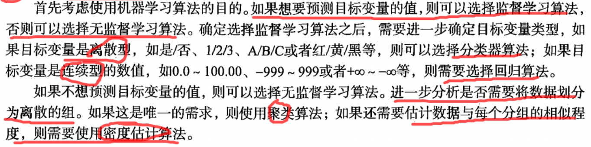

# 第一章  机器学习基础
## 1.1 何谓机器学习
* 利用计算机来彰显数据背后的真实含义
* 随着技术指数级增长，我们不仅需要使用更好的工具解析当前的数据，而且还要为将来可能产生的数据做好充分的准备
* 简单地说，**机器学习就是把无序的数据转换成有用的信息**

## 1.2 关键术语
* 训练集：已分类的数据，用于训练机器学习算法的数据样本集合
* 特征：重要的属性
* 目标变量：机器学习算法的预测结果

## 1.3 机器学习的主要任务
* 监督学习：这类算法必须知道预测什么，即目标变量的分类信息
  1. 分类：主要将实例数据划分到合适的分类中
  2. 回归：主要用于预测数值型数据
* 无监督学习：数据没有类别信息，也不会给定目标值
  1. 聚类：数据集合分成由类似的对象组成的多个类的过程
  2. 密度估计：寻找描述数据统计值的过程

## 1.4 如何选择合适的算法
* 必须思考以下问题：
1. 使用机器学习算法的目的，想要完成何种任务：

   

2. 需要分析或收集的数据是什么:
  主要了解数据的以下特性：

  * 特征值是离散型还是连续型
  * 特征值中是否存在缺失的值，何种原因造成
  * 数据中是否存在异常值
  * 某个特征发生的频率如何

## 1.5 开发机器学习应用程序的步骤
1. 收集数据
2. 准备输入数据
3. 分析输入数据
4. 训练算法
5. 测试算法
6. 使用算法
