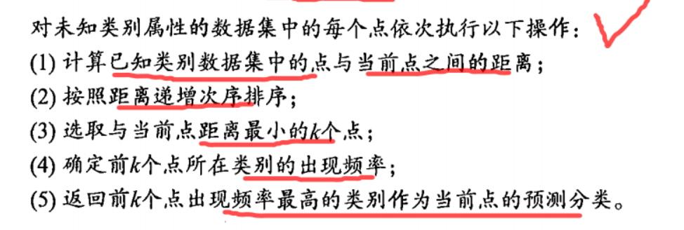
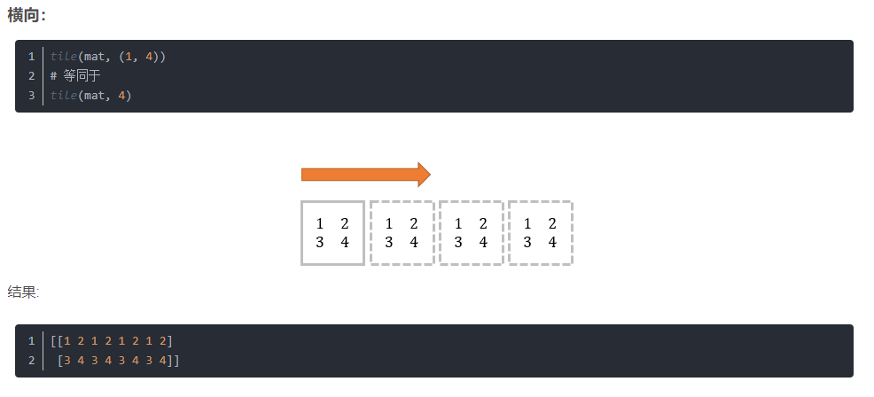
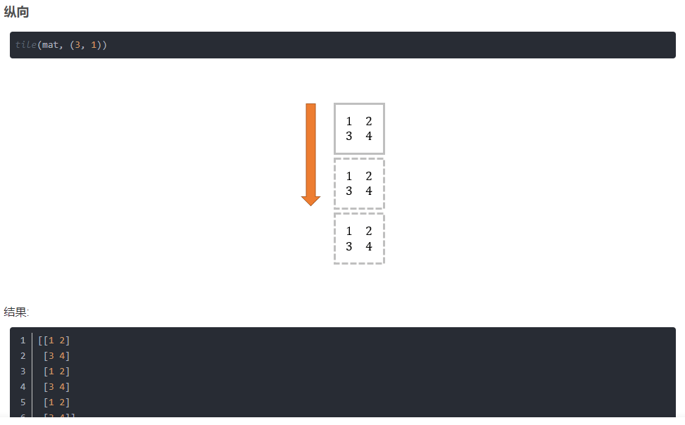
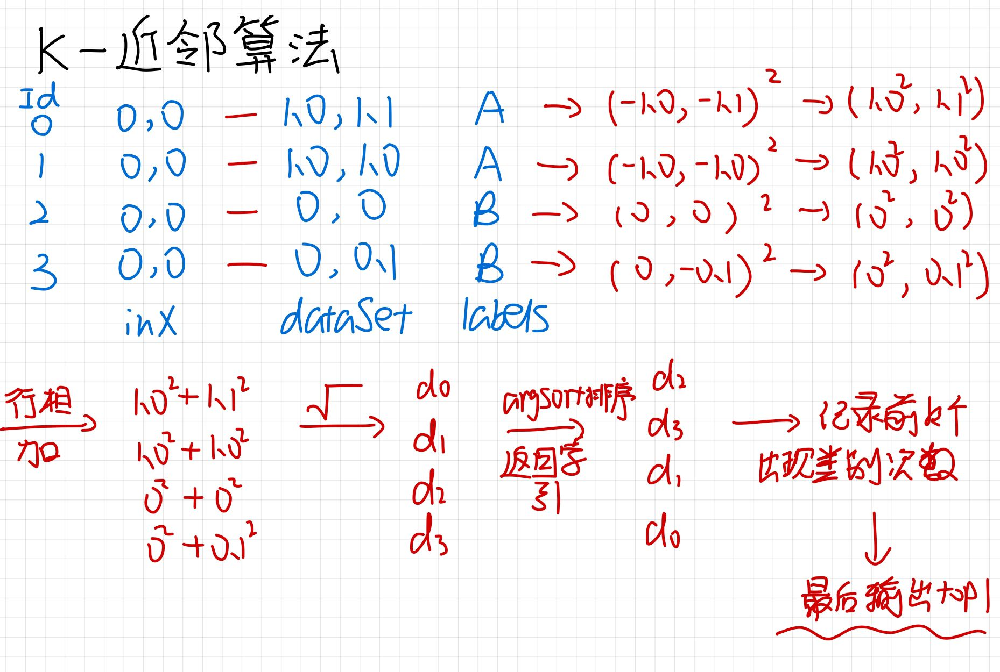
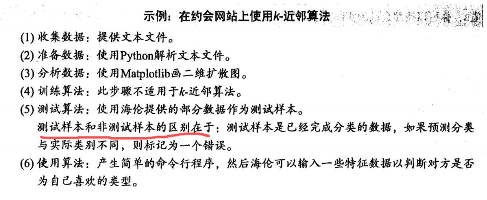
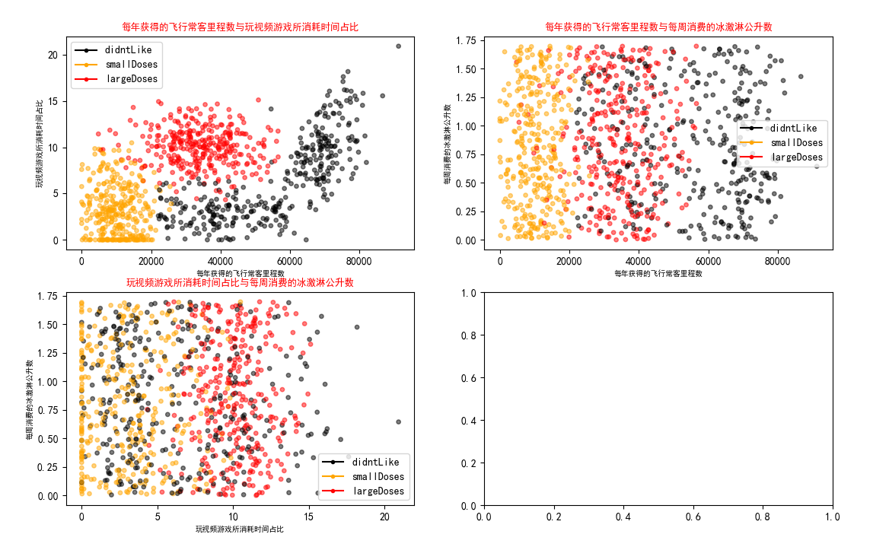

# 第二章  K-近邻算法
## 2.1 K-近邻算法概述
* **K-近邻算法采用测量不同特征值之间的距离方法进行分类**
* ***K Nearest Neighbor——KNN算法***

* 工作原理：

     

* 一般流程：

     

* 伪代码：

     
     
* 代码要点
  1. shape()函数
    shape函数是numpy.core.fromnumeric中的函数，它的功能是**查看矩阵或者数组的维数**
  
    
  
  2. tile()函数
    Numpy的 tile() 函数，就是将原矩阵横向、纵向地复制。tile 是瓷砖的意思，顾名思义，**这个函数就是把数组像瓷砖一样铺展开来**。





 3. sum()函数
    sum() 没有axis参数**表示全部数据相加**
    axis=0，**表示按列相加**
    axis=1，**表示按行相加**

 4. 距离计算

    

​	


* 源代码
```python
'''
Author: PuPuoo
Date: 2023-04-11 16:00:03
LastEditors: PuPuoo
LastEditTime: 2023-04-11 21:03:05
FilePath: \machine-learning\kNN.py
Description: 基本的通用函数
'''

""" 
    导入两个模块：
        科学计算包NumPy
        运算符operator    
"""
import numpy as np
import operator

# 创建数据集和标签
def createDataSet():
    group = np.array([[1.0,1.1],[1.0,1.0],[0,0],[0,0.1]])
    labels = ['A','A','B','B']
    return group,labels

'''
description: 
param {*} inX 用于分类的数据（测试集）
param {*} dataSet 用于训练的数据（训练集）
param {*} labels 标签向量
param {*} k 选择最近邻居的数目
return {*}
'''
def classify0(inX, dataSet, labels, k):
    # numpy函数shape[0]返回dataSet的行数
    dataSetSize = dataSet.shape[0]
    # 将inX重复dataSetSize次并排成一列
    diffMat = np.tile(inX, (dataSetSize, 1)) - dataSet
    # 二维特征相减后平方（用diffMat的转置乘diffMat）
    sqDiffMat = diffMat**2
    # sum()所有元素相加，sum(0)列相加，sum(1)行相加
    sqDistances = sqDiffMat.sum(axis=1)
    # 开方，计算出距离
    distances = sqDistances**0.5
    # argsort函数返回的是distances值从小到大的--索引值
    sortedDistIndicies = distances.argsort()
    # 定义一个记录类别次数的字典
    classCount = {}
    # 选择距离最小的k个点
    for i in range(k):
        # 取出前k个元素的类别
        voteIlabel = labels[sortedDistIndicies[i]]
        # 字典的get()方法，返回指定键的值，如果值不在字典中返回0
        # 计算类别次数
        classCount[voteIlabel] = classCount.get(voteIlabel, 0) + 1
    # python3中用items()替换python2中的iteritems()
    # key = operator.itemgetter(1)根据字典的值进行排序
    # key = operator.itemgetter(0)根据字典的键进行排序
    # reverse降序排序字典
    sortedClassCount = sorted(classCount.items(),
                              key = operator.itemgetter(1), reverse = True)
    # 返回次数最多的类别，即所要分类的类别
    return sortedClassCount[0][0]

# test
group,labels = createDataSet()
print(classify0([0,0],group,labels,3))


```

* 算法图

  

* 如何测试分类器
	**错误率**——常用的评估方法，主要用于评估分类器在某个数据集上的执行效果
	通过大量的测试数据，我们可以得到分类器的错误率:
	**分类器给出错误结果的次数除以测试执行的总数**


## 2.2 示例：使用K-近邻算法改进约会网站的配对效果
* 一般流程

  

### 2.2.1 准备数据：从文本文件中解析数据
* 源代码
```python
'''
description: 打开解析文件,对数据进行分类,1代表不喜欢,2代表魅力一般,3代表极具魅力
param {*} filename
return {*}
'''
def file2matrix(filename):
    # 打开文件
    fr = open(filename)
    # 读取文件所有内容
    arrayOlines = fr.readlines()
    # 得到文件行数
    numberOfLines = len(arrayOlines)
    # 返回以零填充的的NumPy矩阵numberOfLines行，3列
    returnMat = np.zeros((numberOfLines, 3))
    # 创建分类标签向量
    classLabelVector = []
    # 行的索引值
    index = 0
    # 读取每一行
    for line in arrayOlines:
        # 去掉每一行首尾的空白符，例如'\n','\r','\t',' '
        line = line.strip()
        # 将每一行内容根据'\t'符进行切片,本例中一共有4列
        listFromLine = line.split('\t')
        # 将数据的前3列进行提取保存在returnMat矩阵中，也就是特征矩阵
        returnMat[index,:] = listFromLine[0:3]
        # 根据文本内容进行分类1：不喜欢；2：一般；3：喜欢
        if listFromLine[-1] == 'didntLike':
            classLabelVector.append(1)
        elif listFromLine[-1] == 'smallDoses':
            classLabelVector.append(2)
        elif listFromLine[-1] == 'largeDoses':
            classLabelVector.append(3)
        index += 1
    # 返回特征矩阵以及标签向量
    return returnMat, classLabelVector

# test
datingDataMat,datingLabels = file2matrix('datingTestSet.txt')
print(datingDataMat)
print(datingLabels[0:20])

```

### 2.2.2 分析数据：使用Matplotlib创建散点图
* 源代码
```python
import matplotlib.lines as mlines
import matplotlib.pyplot as plt
import matplotlib

""" 
    (2)AttributeError: Text.set() got an unexpected keyword argument 'frac'
    (2)原因在于 pip 安装的为较高版本 matplotlib 库,Text 对象不再需要 frac 参数，删除该参数即可。
"""

matplotlib.rcParams['font.family']='SimHei'

'''
description: 可视化数据
param {*} datingDataMat 特征矩阵
param {*} datingLabels 标签向量
return {*}
'''
def showdatas(datingDataMat, datingLabels):
	#设置汉字格式
	# font = FontProperties(fname=r"C:\Windows\Fonts\simsunb.ttf", size=14)  ##需要查看自己的电脑是否会包含该字体
	#将fig画布分隔成1行1列,不共享x轴和y轴,fig画布的大小为(13,8)
	#当nrow=2,nclos=2时,代表fig画布被分为四个区域,axs[0][0]表示第一行第一个区域
	fig, axs = plt.subplots(nrows=2, ncols=2,sharex=False, sharey=False, figsize=(13,8))

	numberOfLabels = len(datingLabels)
	LabelsColors = []
	for i in datingLabels:
		if i == 1:
			LabelsColors.append('black')
		if i == 2:
			LabelsColors.append('orange')
		if i == 3:
			LabelsColors.append('red')
	#画出散点图,以datingDataMat矩阵的第一(飞行常客例程)、第二列(玩游戏)数据画散点数据,散点大小为15,透明度为0.5
	axs[0][0].scatter(x=datingDataMat[:,0], y=datingDataMat[:,1], color=LabelsColors,s=15, alpha=.5)
	#设置标题,x轴label,y轴label
	axs0_title_text = axs[0][0].set_title(u'每年获得的飞行常客里程数与玩视频游戏所消耗时间占比')
	axs0_xlabel_text = axs[0][0].set_xlabel(u'每年获得的飞行常客里程数')
	axs0_ylabel_text = axs[0][0].set_ylabel(u'玩视频游戏所消耗时间占比')
	plt.setp(axs0_title_text, size=9, weight='bold', color='red')  
	plt.setp(axs0_xlabel_text, size=7, weight='bold', color='black')  
	plt.setp(axs0_ylabel_text, size=7, weight='bold', color='black') 

	#画出散点图,以datingDataMat矩阵的第一(飞行常客例程)、第三列(冰激凌)数据画散点数据,散点大小为15,透明度为0.5
	axs[0][1].scatter(x=datingDataMat[:,0], y=datingDataMat[:,2], color=LabelsColors,s=15, alpha=.5)
	#设置标题,x轴label,y轴label
	axs1_title_text = axs[0][1].set_title(u'每年获得的飞行常客里程数与每周消费的冰激淋公升数')
	axs1_xlabel_text = axs[0][1].set_xlabel(u'每年获得的飞行常客里程数')
	axs1_ylabel_text = axs[0][1].set_ylabel(u'每周消费的冰激淋公升数')
	plt.setp(axs1_title_text, size=9, weight='bold', color='red')  
	plt.setp(axs1_xlabel_text, size=7, weight='bold', color='black')  
	plt.setp(axs1_ylabel_text, size=7, weight='bold', color='black') 

	#画出散点图,以datingDataMat矩阵的第二(玩游戏)、第三列(冰激凌)数据画散点数据,散点大小为15,透明度为0.5
	axs[1][0].scatter(x=datingDataMat[:,1], y=datingDataMat[:,2], color=LabelsColors,s=15, alpha=.5)
	#设置标题,x轴label,y轴label
	axs2_title_text = axs[1][0].set_title(u'玩视频游戏所消耗时间占比与每周消费的冰激淋公升数')
	axs2_xlabel_text = axs[1][0].set_xlabel(u'玩视频游戏所消耗时间占比')
	axs2_ylabel_text = axs[1][0].set_ylabel(u'每周消费的冰激淋公升数')
	plt.setp(axs2_title_text, size=9, weight='bold', color='red')  
	plt.setp(axs2_xlabel_text, size=7, weight='bold', color='black')  
	plt.setp(axs2_ylabel_text, size=7, weight='bold', color='black') 
	#设置图例
	didntLike = mlines.Line2D([], [], color='black', marker='.',
                      markersize=6, label='didntLike')
	smallDoses = mlines.Line2D([], [], color='orange', marker='.',
	                  markersize=6, label='smallDoses')
	largeDoses = mlines.Line2D([], [], color='red', marker='.',
	                  markersize=6, label='largeDoses')
	#添加图例
	axs[0][0].legend(handles=[didntLike,smallDoses,largeDoses])
	axs[0][1].legend(handles=[didntLike,smallDoses,largeDoses])
	axs[1][0].legend(handles=[didntLike,smallDoses,largeDoses])
	#显示图片
	plt.show()
        
# test
datingDataMat,datingLabels = file2matrix('datingTestSet.txt')
showdatas(datingDataMat,datingLabels)

```

* 散点图

  


### 2.2.3 准备数据：归一化数值
* 为什么归一化处理？
  * 我们很容易发现，上面方程中**数字差值最大的属性对计算结果的影响最大**，也就是说，每年获取的飞行常客里程数对于计算结果的影响将远远大于表2-3中其他两个特征—— 玩视频游戏的和每周消费冰洪淋公升数 的影响。
  
  * 而产生这种现象的唯一原因，仅仅是因为飞行常客里程数远大于其他特征值。但这三种特征是同等重要的，因此作为三个等权重的特征之一，飞行常客里程数并不应该如此严重地影响到计算结果。
  
  * 在处理这种不同取值范围的特征值时，我们通常采用的方法是将**数值归一化**，如将取值范围处理为0到1或者-1到1之间。下面的公式可以将任意取值范围的特征值转化为0到1区间内的值：
  
    

* 源代码
```python
'''
description: 对数据进行归一化 相当于长度之比 从而将特征值转化为0-1之间
param {*} dataSet 特征矩阵
return {*}
'''
def autoNorm(dataSet):
    """ 
        a.min()返回的就是a中所有元素的最小值
        a.min(0)返回的就是a的每列最小值
        a.min(1)返回的是a的每行最小值
    """
    # 获取数据的最小值
    minVals = dataSet.min(0)
    # 获取数据的最大值
    maxVals = dataSet.max(0)
    # 最大值和最小值的范围
    ranges = maxVals - minVals
    # shape(dataSet)返回dataSet的矩阵行列数
    normDataSet = np.zeros(np.shape(dataSet))
    # numpy函数shape[0]返回dataSet的行数
    m = dataSet.shape[0]
    # 原始值减去最小值（x-xmin）
    normDataSet = dataSet - np.tile(minVals, (m, 1))
    # 差值处以最大值和最小值的差值（x-xmin）/（xmax-xmin）
    normDataSet = normDataSet / np.tile(ranges, (m, 1))
    # 归一化数据结果，数据范围，最小值
    return normDataSet, ranges, minVals

# test
datingDataMat,datingLabels = file2matrix('datingTestSet.txt')
normMat, ranges, minVals = autoNorm(datingDataMat)
print(normMat)
print(ranges)
print(minVals)

```

### 2.2.4 测试算法：作为完整程序验证分类器
* 机器学习算法一个很重要的工作就是**评估算法的正确率**，通常我们只提供已有**数据的90%**作为训练样本来训练分类器 ，而使用**其余的10%数据**去测试分类器，检测分类器的正确率。
* 需要注意的是，10%的测试数据应该是**随机选择**的，由于提供的数据并没有按照特定目的来排序，所以我们可以随意选择10%数据而不影响其随机性。

* 源代码
```python
'''
description: 分类器测试函数
return {*}
'''
def datingClassTest():
    # 打开文件名
    filename = "datingTestSet.txt"
    # 将返回的特征矩阵和分类向量分别存储到datingDataMat和datingLabels中
    datingDataMat, datingLabels = file2matrix(filename)
    # 取所有数据的10% hoRatio越小，错误率越低
    hoRatio = 0.10
    # 数据归一化，返回归一化数据结果，数据范围，最小值
    normMat, ranges, minVals = autoNorm(datingDataMat)
    # 获取normMat的行数
    m = normMat.shape[0]
    # 10%的测试数据的个数
    numTestVecs = int(m * hoRatio)
    # 分类错误计数
    errorCount = 0.0
    for i in range(numTestVecs):
        # 前numTestVecs个数据作为测试集，后m-numTestVecs个数据作为训练集
        # k选择label数+1（结果比较好）
        classifierResult = classify0(normMat[i,:], normMat[numTestVecs:m,:],\
                                     datingLabels[numTestVecs:m], 4)
        print("分类结果:%d\t真实类别:%d" % (classifierResult, datingLabels[i]))
        if classifierResult != datingLabels[i]:
            errorCount += 1.0
    print("错误率:%f%%" % (errorCount/float(numTestVecs)*100))

# test
datingClassTest()

```

### 2.2.5 使用算法：构建完整可用系统
* 上面我们已经在数据上对分类器进行了测试，现在终于可以使用这个分类器来对人们分类。我们会给一小段程序，通过该程序可以在约会网站上找到某个人并输入他的信息。程序会给出对对方喜欢程度的预测值。

* 源代码
```python
'''
description: 通过输入一个人的三维特征，进行分类输出
return {*}
'''
def classifyPerson():
    # 输出结果
    resultList = ['讨厌', '有些喜欢', '非常喜欢']
    # 三维特征用户输入
    percentTats = float(input("玩视频游戏所消耗时间百分比："))
    ffMiles = float(input("每年获得的飞行常客里程数："))
    iceCream = float(input("每周消费的冰淇淋公升数："))
    # 打开的文件名
    filename = "datingTestSet.txt"
    # 打开并处理数据
    datingDataMat, datingLabels = file2matrix(filename)
    # 训练集归一化
    normMat, ranges, minVals = autoNorm(datingDataMat)
    # 生成NumPy数组，测试集
    inArr = np.array([percentTats, ffMiles, iceCream])
    # 测试集归一化
    norminArr = (inArr - minVals) / ranges
    # 返回分类结果
    classifierResult = classify0(norminArr, normMat, datingLabels, 4)
    # 打印结果
    print("你可能%s这个人" % (resultList[classifierResult - 1]))

# test
classifyPerson()

```


## 2.3 示例：手写识别系统
* 一般流程

  

  

### 2.3.1 准备数据：将图像转化为测试向量
* 为了使用前面两个例子的分类器，我们必须将图像格式化处理为一个向量。我们将把一个32 X 32的二进制图像矩阵转换为1 X 1024的向量，这样前两节使用的分类器就可以处理数字图像信息了。

* 源代码
```python
'''
description: 将32*32的二进制图像转换为1*1024向量
param {*} filename 文件名
return {*}
'''
def img2vector(filename):
    # 创建1*1024零向量
    returnVect = np.zeros((1, 1024))
    # 打开文件
    fr = open(filename)
    # 按行读取
    for i in range(32):
        # 读取一行数据
        lineStr = fr.readline()
        # 每一行的前32个数据依次存储到returnVect中
        for j in range(32):
            returnVect[0, 32*i+j] = int(lineStr[j])
    # 返回转换后的1*1024向量
    return returnVect

# test
"""  
    出现错误ValueError: embedded null character,原因是路径问题,修改一下,将其中的\全都改成\\即可
"""
testVector = img2vector('testDigits\\0_13.txt')
print(testVector[0,0:31])

```

### 2.3.2 测试算法：使用K-近邻算法识别手写数字
* 本节我们将这些数据输入到分类器，检测分类器的执行效果。
* 我们必须确保将from os import listdir 写入文件的起始部分，这段代码的主要功能是从os模块中导入函数listdir，它可以列出给定目录的文件名

* 由于文件中的值已经0-1之间, 本节并不需要使用2.2节autoNorm()归一化函数

* 源代码
```python
'''
description: 手写数字分类测试
return {*}
'''
def handwritingClassTest():
	#测试集的Labels
	hwLabels = []
	#返回trainingDigits目录下的文件名
	trainingFileList = listdir('trainingDigits')
	#返回文件夹下文件的个数
	m = len(trainingFileList)
	#初始化训练的Mat矩阵,测试集
	trainingMat = np.zeros((m, 1024))
	#从文件名中解析出训练集的类别
	for i in range(m):
		#获得文件的名字
		fileNameStr = trainingFileList[i]
		#获得分类的数字
		classNumber = int(fileNameStr.split('_')[0])
		#将获得的类别添加到hwLabels中
		hwLabels.append(classNumber)
		#将每一个文件的1x1024数据存储到trainingMat矩阵中
		trainingMat[i,:] = img2vector('trainingDigits/%s' % (fileNameStr))
	#返回testDigits目录下的文件名
	testFileList = listdir('testDigits')
	#错误检测计数
	errorCount = 0.0
	#测试数据的数量
	mTest = len(testFileList)
	#从文件中解析出测试集的类别并进行分类测试
	for i in range(mTest):
		#获得文件的名字
		fileNameStr = testFileList[i]
		#获得分类的数字
		classNumber = int(fileNameStr.split('_')[0])
		#获得测试集的1x1024向量,用于训练
		vectorUnderTest = img2vector('testDigits/%s' % (fileNameStr))
		#获得预测结果
		classifierResult = classify0(vectorUnderTest, trainingMat, hwLabels, 3)
		print("分类返回结果为%d\t真实结果为%d" % (classifierResult, classNumber))
		if(classifierResult != classNumber):
			errorCount += 1.0
	print("总共错了%d个数据\n错误率为%f" % (errorCount, errorCount/mTest))

# test
handwritingClassTest()


```


## 2.4 本章小结


* K-近邻算法的缺点
  1. 缺点1
  	k近邻算法**最大的缺点是它的效率低下**，可以想象一下如果训练集有m个样本，n个特征，则预测每一个新的数据，需要o(m*m)这么多的时间复杂度
		
	
  	***解决办法：可以使用一些树的结构，比如KD-Tree,Ball-Tree等来更快的求出k近邻，但是即使如此仍然是一个效率很低的算法***
  	
  2. 缺点2
  	**预测结果不具有可解释性**。只是找到了和我们要预测样本比较近的样本，我们就说我们要预测的样本属于这个类别，但是我们要预测的样本为什么属于这个类别，我们根本无从知晓，那么在很多研究上，我们只拿到这个预测结果是远远不够的，我们希望对预测结果有一定的解释性，而我们能通过这些解释来推广或者去制作新的工具或者是以此为基础发展新的理论或者规则来改进我们生产环境中其他的方面，这些都是k近邻算法做不了的
  
	3. 缺点3
		k近邻算法**更大的缺点就是维数灾难**，所谓的维数灾难就是随着维度的增加，“看似相近”的两个点之间的距离越来越大，而k近邻算法非常依赖两个点之间距离的计算，这使得一旦我们使用k近邻算法处理一些高维度问题的时候就很有可能造成维数的灾难
	
  	***解决办法：可采用降维***