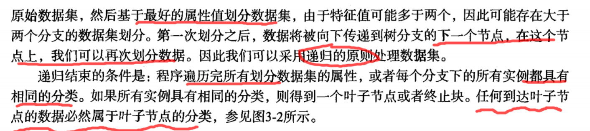
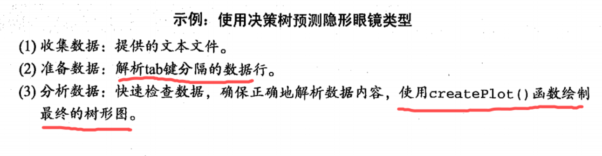

# 第三章  决策树
* ***Decision Tree***

* 决策树的工作原理与20个问题类似，用户输入一系列数据，然后给出游戏的答案

* 决策树的流程图：

  

  

* 接下来我们将学习如何从一堆原始数据中构造决策树：**本书使用ID3算法划分数据集**
  * 首先我们讨论构造决策树的方法，以及如何编写构造树的python代码
  * 接着提出一些度量算法成功率的方法
  * 最后使用递归建立分类器，并且使用Matplotlib制决策树图。
  * 构造完成决策树分类器之后，我们将输人一些隐形眼镜的处方数据，并由决策树分类器预测需要的镜片类型。

## 3.1 决策树的构造
#### 1 工作原理

  

  

#### 2 伪代码

  

#### 3 一般流程

  

#### 4 举例表格


### 3.1 1 信息增益

* **划分数据集的大原则：将无序的数据变得更加有序**
  * 组织杂乱无章数据的一种方法就是使用信息论度量信息，信息论是量化处理信息的分支科学。我们可以在划分数据之前使用**信息论量化度量信息的内容**。

* 信息的含义

  

* 信息增益

  * **在划分数据集之前之后信息发生的变化**

  * **信息增益是熵的减少或者是数据无序度的减少**

  * 通过计算信息增益，我们就可以计算每个特征值划分数据集获得的信息增益，**获得信息增益最高的特征就是最好的选择**

* 香农熵（熵）

  **无序度量值**

  **信息的期望值**
  
  

​		其中n为分类的数目

​		 ***熵越高，代表混合的数据也越多，从而度量数据集的无序程度***

  * 计算熵的源代码
```python
  
  '''
Author: PuPuoo
Date: 2023-04-12 14:36:17
LastEditors: PuPuoo
LastEditTime: 2023-04-12 14:51:12
FilePath: \03-决策树\trees.py
Description: 决策树代码
'''

from math import log

'''
description: 计算给定数据集的香农熵
param {*} dataSet 数据集
return {*}
'''
def calcShannonEnt(dataSet):
	numEntires = len(dataSet)						#返回数据集的行数
	labelCounts = {}								#保存每个标签(Label)出现次数的字典
	for featVec in dataSet:							#对每组特征向量进行统计
		currentLabel = featVec[-1]					#提取标签(Label)信息
		if currentLabel not in labelCounts.keys():	#如果标签(Label)没有放入统计次数的字典,添加进去
			labelCounts[currentLabel] = 0
		labelCounts[currentLabel] += 1				#Label计数
	shannonEnt = 0.0								#经验熵(香农熵)
	for key in labelCounts:							#计算香农熵
		prob = float(labelCounts[key]) / numEntires	#选择该标签(Label)的概率
		shannonEnt -= prob * log(prob, 2)			#利用公式计算
	return shannonEnt								#返回经验熵(香农熵)


'''
description: 创建数据集以及标签向量
return {*}
'''
def createDataSet():
	dataSet = [[1,1,'yes'],[1,1,'yes'],[1,0,'no'],[0,1,'no'],[0,1,'no']]
	labels = ['no surfacing','flippers']
	return dataSet,labels


# test
myDat,labels = createDataSet()
print(myDat)
print(calcShannonEnt(myDat))

# test
myDat[0][-1] = 'maybe'
print(myDat)
print(calcShannonEnt(myDat))  

```

* 得到熵之后，我们就可以按照获取最大信息增益的方法划分数据集，下一步我们将具体学习**如何划分数据集**以及**如何度量信息增益**
* 另一个度量集合无序程度的方法是**基尼不纯度(Gini impurity),** 简单地说就是从一个数据集中随机选取子项，度量其被错误分类到其他分组里的概率。本书不采用基尼不纯度方法，这里就不再做进一步的介绍。下面我们将学习如何划分数据集，并创建决策树。

### 3.1.2 划分数据集
#### 1 按照给定特征划分数据集
* 代码要点

  * append()函数与extend()函数

    

* 源代码
```python
'''
description: 按照给定特征的值划分数据集
param {*} dataSet 待划分的数据集
param {*} axis 划分数据集的特征（索引号）
param {*} value 划分特征的值
return {*}
'''
def splitDataSet(dataSet, axis, value):		
	retDataSet = []										#创建返回的数据集列表
	for featVec in dataSet: 							#遍历数据集
		if featVec[axis] == value:
			reducedFeatVec = featVec[:axis]				#去掉axis特征
			reducedFeatVec.extend(featVec[axis+1:]) 	#将符合条件的添加到返回的数据集
			retDataSet.append(reducedFeatVec)
	return retDataSet		  							#返回划分后的数据集

# test
myDat,labels = createDataSet()
print(myDat)
print(splitDataSet(myDat,0,1))
print(splitDataSet(myDat,0,0))

```

* 算法图

  


#### 2 选择最好的数据集划分方式
* 代码要点

  
  
  * **信息增益是熵的减少或者是数据无序度的减少**

* 源代码
```python
'''
description: 选择最优特征
param {*} dataSet 待划分的数据集
return {*}
'''
def chooseBestFeatureToSplit(dataSet):
	numFeatures = len(dataSet[0]) - 1					#特征数量
	baseEntropy = calcShannonEnt(dataSet) 				#计算数据集的香农熵
	bestInfoGain = 0.0  								#信息增益
	bestFeature = -1									#最优特征的索引值
	for i in range(numFeatures): 						#遍历所有特征
		#获取dataSet的第i个所有特征
		featList = [example[i] for example in dataSet]
		uniqueVals = set(featList)     					#创建set集合{},元素不可重复
		newEntropy = 0.0  								#经验条件熵
		for value in uniqueVals: 						#计算信息增益
			subDataSet = splitDataSet(dataSet, i, value) 		#subDataSet划分后的子集
			prob = len(subDataSet) / float(len(dataSet))   		#计算子集的概率
			newEntropy += prob * calcShannonEnt(subDataSet) 	#根据公式计算经验条件熵
		infoGain = baseEntropy - newEntropy 					#信息增益
		# print("第%d个特征的增益为%.3f" % (i, infoGain))			#打印每个特征的信息增益
		if (infoGain > bestInfoGain): 							#计算信息增益
			bestInfoGain = infoGain 							#更新信息增益，找到最大的信息增益
			bestFeature = i 									#记录信息增益最大的特征的索引值
	return bestFeature 											#返回信息增益最大的特征的索引值

# test
myDat,labels = createDataSet()
print(chooseBestFeatureToSplit(myDat))

```

#### 3 总结
* 本节我们学习了**如何度量数据集的信息熵**，**如何有效的划分数据集**
* 下一节我们将介绍**如何将这些函数功能放在一起，构建决策树**

### 3.1.3 递归构建决策树
* 工作原理

  


  

#### 1 统计classList中出现此处最多的元素(类标签)
* 源代码
```python
'''
description: 统计classList中出现最多的元素(类标签)
param {*} classList 类标签列表
return {*}
'''
def majorityCnt(classList):
	classCount = {}
	for vote in classList:										#统计classList中每个元素出现的次数
		if vote not in classCount.keys():classCount[vote] = 0	
		classCount[vote] += 1
	sortedClassCount = sorted(classCount.items(), key = operator.itemgetter(1), reverse = True)		#根据字典的值降序排序
	return sortedClassCount[0][0]								#返回classList中出现次数最多的元素

```

#### 2 创建树的函数代码

* 源代码
```python
'''
description: 创建决策树
param {*} dataSet 训练数据集
param {*} labels 分类属性标签
param {*} featLabels 存储选择的最优特征标签
return {*}
'''
def createTree(dataSet, labels, featLabels):
	classList = [example[-1] for example in dataSet]			#取分类标签(是否放贷:yes or no)
	if classList.count(classList[0]) == len(classList):			#如果类别完全相同则停止继续划分
		return classList[0]
	if len(dataSet[0]) == 1 or len(labels) == 0:									#遍历完所有特征时返回出现次数最多的类标签
		return majorityCnt(classList)
	bestFeat = chooseBestFeatureToSplit(dataSet)				#选择最优特征
	bestFeatLabel = labels[bestFeat]							#最优特征的标签
	featLabels.append(bestFeatLabel)
	myTree = {bestFeatLabel:{}}									#根据最优特征的标签生成树
	del(labels[bestFeat])										#删除已经使用特征标签
	featValues = [example[bestFeat] for example in dataSet]		#得到训练集中所有最优特征的属性值
	uniqueVals = set(featValues)								#去掉重复的属性值
	for value in uniqueVals:									#遍历特征，创建决策树。
		subLabels = labels[:]
		myTree[bestFeatLabel][value] = createTree(splitDataSet(dataSet, bestFeat, value), subLabels, featLabels)
        
	return myTree

# test
myDat,labels = createDataSet()
featLabels = []
print(createTree(myDat,labels,featLabels))

```

* 算法图

  

  


## 3.2 在python中使用Matplotlib注解绘制树形图
* 图例

  

* 源代码
```python
#绘制决策树
import matplotlib.pyplot as plt
import matplotlib

decisionNode = dict(boxstyle="sawtooth", fc="0.8")
leafNode = dict(boxstyle="round4", fc="0.8")
arrow_args = dict(arrowstyle="<-")
 
 
def plotNode(nodeTxt, centerpt, parentpt, nodeType):
    createPlot.axl.annotate(nodeTxt, xy=parentpt, xycoords='axes fraction', xytext=centerpt,
                            textcoords='axes fraction', va="center", ha="center", bbox=nodeType, arrowprops=arrow_args)
 
def createPlot():
    fig = plt.figure(1, facecolor='white')
    fig.clf()
    createPlot.axl = plt.subplot(111, frameon=False)
    plotNode('a decision node', (0.5, 0.1), (0.1, 0.5), decisionNode)
    plotNode('a left node', (0.8, 0.1), (0.3, 0.8), leafNode)
    plt.show()

'''
description: 获取决策树叶子结点的数目
param {*} myTree 决策树
return {*}
'''
def getNumLeafs(myTree):
    numLeafs = 0												#初始化叶子
    firstStr = next(iter(myTree))								#python3中myTree.keys()返回的是dict_keys,不再是list,所以不能使用myTree.keys()[0]的方法获取结点属性，可以使用list(myTree.keys())[0]
    secondDict = myTree[firstStr]								#获取下一组字典
    for key in secondDict.keys():
        if type(secondDict[key]).__name__=='dict':				#测试该结点是否为字典，如果不是字典，代表此结点为叶子结点
            numLeafs += getNumLeafs(secondDict[key])
        else:   numLeafs +=1
    return numLeafs


'''
description: 获取决策树的层数
param {*} myTree 决策树
return {*}
'''
def getTreeDepth(myTree):
    maxDepth = 0												#初始化决策树深度
    firstStr = next(iter(myTree))								#python3中myTree.keys()返回的是dict_keys,不再是list,所以不能使用myTree.keys()[0]的方法获取结点属性，可以使用list(myTree.keys())[0]
    secondDict = myTree[firstStr]								#获取下一个字典
    for key in secondDict.keys():
        if type(secondDict[key]).__name__=='dict':				#测试该结点是否为字典，如果不是字典，代表此结点为叶子结点
            thisDepth = 1 + getTreeDepth(secondDict[key])
        else:   thisDepth = 1
        if thisDepth > maxDepth: maxDepth = thisDepth			#更新层数
    return maxDepth

matplotlib.rcParams['font.family']='SimHei'


'''
description: 绘制结点
param {*} nodeTxt 结点名
param {*} centerPt 文本位置
param {*} parentPt 标注的箭头位置
param {*} nodeType 结点格式
return {*}
'''
def plotNode(nodeTxt, centerPt, parentPt, nodeType):
	arrow_args = dict(arrowstyle="<-")											#定义箭头格式
	#font = FontProperties(fname=r"c:\windows\fonts\simsunb.ttf", size=14)		#设置中文字体
	createPlot.ax1.annotate(nodeTxt, xy=parentPt,  xycoords='axes fraction',	#绘制结点
		xytext=centerPt, textcoords='axes fraction',
		va="center", ha="center", bbox=nodeType, arrowprops=arrow_args)


'''
description: 标注有向边属性值
param {*} cntrPt 用于计算标注位置
param {*} parentPt
param {*} txtString 标注的内容
return {*}
'''
def plotMidText(cntrPt, parentPt, txtString):
	xMid = (parentPt[0]-cntrPt[0])/2.0 + cntrPt[0]											#计算标注位置					
	yMid = (parentPt[1]-cntrPt[1])/2.0 + cntrPt[1]
	createPlot.ax1.text(xMid, yMid, txtString)


'''
description: 绘制决策树
param {*} myTree 决策树（字典）
param {*} parentPt 标注的内容
param {*} nodeTxt 结点名
return {*}
'''
def plotTree(myTree, parentPt, nodeTxt):
	decisionNode = dict(boxstyle="sawtooth", fc="0.8")										#设置结点格式
	leafNode = dict(boxstyle="round4", fc="0.8")											#设置叶结点格式
	numLeafs = getNumLeafs(myTree)  														#获取决策树叶结点数目，决定了树的宽度
	depth = getTreeDepth(myTree)															#获取决策树层数
	firstStr = next(iter(myTree))															#下个字典     											
	cntrPt = (plotTree.xOff + (1.0 + float(numLeafs))/2.0/plotTree.totalW, plotTree.yOff)	#中心位置
	plotMidText(cntrPt, parentPt, nodeTxt)													#标注有向边属性值
	plotNode(firstStr, cntrPt, parentPt, decisionNode)										#绘制结点
	secondDict = myTree[firstStr]															#下一个字典，也就是继续绘制子结点
	plotTree.yOff = plotTree.yOff - 1.0/plotTree.totalD										#y偏移
	for key in secondDict.keys():								
		if type(secondDict[key]).__name__=='dict':											#测试该结点是否为字典，如果不是字典，代表此结点为叶子结点
			plotTree(secondDict[key],cntrPt,str(key))        								#不是叶结点，递归调用继续绘制
		else:																				#如果是叶结点，绘制叶结点，并标注有向边属性值 											
			plotTree.xOff = plotTree.xOff + 1.0/plotTree.totalW
			plotNode(secondDict[key], (plotTree.xOff, plotTree.yOff), cntrPt, leafNode)
			plotMidText((plotTree.xOff, plotTree.yOff), cntrPt, str(key))
	plotTree.yOff = plotTree.yOff + 1.0/plotTree.totalD


'''
description: 创建绘制面板
param {*} inTree 决策树（字典）
return {*}
'''
def createPlot(inTree):
    fig = plt.figure(1, facecolor='white')													#创建fig
    fig.clf()																				#清空fig
    axprops = dict(xticks=[], yticks=[])
    createPlot.ax1 = plt.subplot(111, frameon=False, **axprops)    							#去掉x、y轴
    plotTree.totalW = float(getNumLeafs(inTree))											#获取决策树叶结点数目
    plotTree.totalD = float(getTreeDepth(inTree))											#获取决策树层数
    plotTree.xOff = -0.5/plotTree.totalW; plotTree.yOff = 1.0;								#x偏移
    plotTree(inTree, (0.5,1.0), '')															#绘制决策树
    plt.show()	

# test
myDat,labels = createDataSet()
myTree = createTree(myDat,labels)
createPlot(myTree)
myTree['no surfacing'][3] = 'maybe'
createPlot(myTree)

```

* 效果图

  
  
  
  


## 3.3 测试和存储分类器
### 3.3.1 测试算法：使用决策树执行分类
* 工作原理
  * 在执行数据分类时，需要决策树以及用于构造树的标签向量
  * 然后，程序比较测试数据与决策树上的数值，递归执行该过程直到进人叶子节点
  * 最后将测试数据定义为叶子节点所属的类型

* 源代码
```python
'''
description: 使用决策树分类
param {*} inputTree 已经生成的决策树
param {*} featLabels 存储选择的最优特征标签
param {*} testVec 测试数据列表 顺序对应最优特征标签
return {*}
'''
def classify(inputTree, featLabels, testVec):
	firstStr = next(iter(inputTree))														#获取决策树结点
	secondDict = inputTree[firstStr]														#下一个字典
	featIndex = featLabels.index(firstStr)												
	for key in secondDict.keys():
		if testVec[featIndex] == key:
			if type(secondDict[key]).__name__ == 'dict':
				classLabel = classify(secondDict[key], featLabels, testVec)
			else: classLabel = secondDict[key]
	return classLabel

# test
myDat,labels = createDataSet()
featLabels = []
myTree = createTree(myDat,labels,featLabels)
print(classify(myTree,featLabels,[1,1]))

```

### 3.3.2 使用算法：决策树的存储
* 工作原理
  * **构造决策树是很耗时的任务**，即使处理很小的数据集，如前面的样本数据，也要花费几秒时间,如果数据集很大，将会耗费很多计算时间。
  * 然而用创建好的决策树解决分类问题，则可以很快完成。因此为了节省计算时间，最好能够在**每次执行分类时调佣已经构造好的决策树**，
  * 为了解决这个问题，需要使用python模块**pickle序列化对象**。序列化对象可以在磁盘上保存对象，并在需要的时候读取出来。任何对象都可以执行序列化操作，字典对象也不例外。

* 源代码
```python
'''
description: 存储决策树
param {*} inputTree 已经生成的决策树
param {*} filename 决策树的存储文件名
return {*}
'''
def storeTree(inputTree, filename):
	with open(filename, 'wb') as fw:
		pickle.dump(inputTree, fw)


'''
description: 读取决策树
param {*} filename 决策树的存储文件名
return {*} 决策树字典
'''
def grabTree(filename):
	fr = open(filename, 'rb')
	return pickle.load(fr)


# test
myDat,labels = createDataSet()
featLabels = []
myTree = createTree(myDat,labels,featLabels)
storeTree(myTree,'classifierStorage.txt')
print(grabTree('classifierStorage.txt'))

```


## 3.4 示例：使用决策树预测隐形眼镜类型
* 本节我们将通过一个例子讲解决策树**如何预测患者需要佩戴的隐形眼镜类型**

* 一般流程

  
  

  

* 源代码
```python
# test:预测隐形眼镜类型
fr = open('lenses.txt')
lenses = [inst.strip().split('\t') for inst in fr.readlines()]
lensesLabels = ['age','prescript','astigmatic','tearRate']
featLabels = []
lensesTree = createTree(lenses,lensesLabels,featLabels)
print(lensesTree)
createPlot(lensesTree)
print(classify(lensesTree,featLabels,['normal','yes','myope']))

```

* 结果图


* 上图所示，决策树非常好的匹配了实验数据，然而这些匹配选项可能太多了。我们将这种问题称之为**过度匹配**，为了减少这种问题，我们可以裁剪决策树，去掉一些不必要的叶子结点。如果叶子结点只能增加少许信息，则可以删除该结点，将他并入到其他叶子结点中。第九章将进一步讨论这个问题。
* 第九章我们将学习**另一个决策树构造算法CRAT**，本章使用的算法为**ID3**。它是一个好的算法但并不完美，无法直接处理数值型数据，并且如果存在太多的特征划分，还会面临其它问题。


## 3.5 本章小结


