# 第四章  基于概率论的分类方法：朴素贝叶斯
## 4.1 基于贝叶斯决策理论的分类方法
* 贝叶斯决策理论
  * 选择具有最高概率的决策

* 朴素贝叶斯

  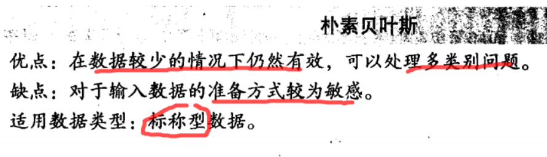


## 4.2 条件概率
* 条件概率

  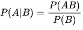

* 贝叶斯公式

  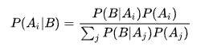


## 4.3 使用条件概率来分类

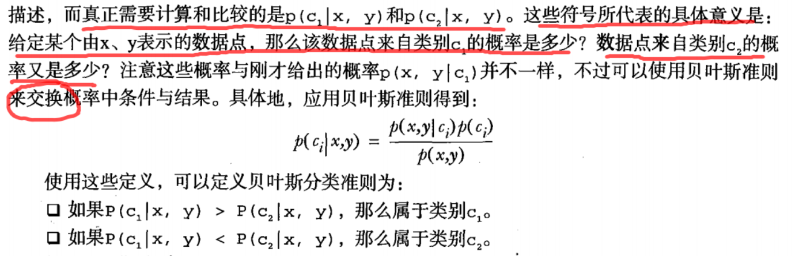


## 4.4 使用朴素贝叶斯进行文档分类
* 一般过程

  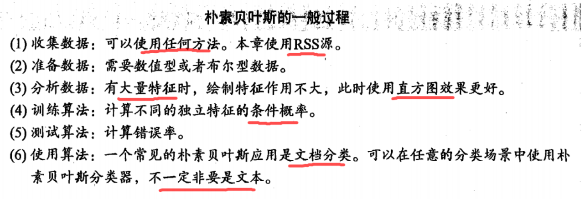

* 样本数

  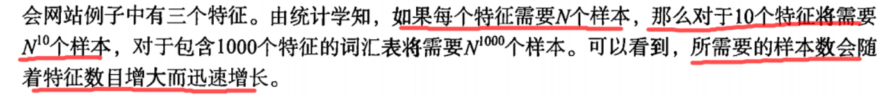

  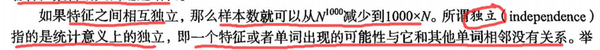


## 4.5 使用python进行文本分类
* 接下来首先给出将文本转换为数字向量的过程
* 然后介绍如何基于这些向量来计算条件概率, 并在此基础上构建分类器
* 最后还要介绍一些利用python实现朴素贝叶斯过程中需要考虑的问题

### 4.5.1 准备数据：从文本中构建词向量
* 基本原理
  * 将一篇文本中的单词转化为词汇表，**再创建一个和词汇表等长的向量**，若另一篇文本出现词汇表中的单词，则标为1，否则标为0，从而形成文本向量

* 源代码
```python
'''
Author: PuPuoo
Date: 2023-04-14 20:52:17
LastEditors: PuPuoo
LastEditTime: 2023-04-14 21:05:41
FilePath: \04-朴素贝叶斯\bayes.py
Description: 朴素贝叶斯
'''


'''
description: 创建实验样本
return {*}  postingList - 实验样本切分的词条
	        classVec - 类别标签向量
'''
def loadDataSet():
	postingList=[['my', 'dog', 'has', 'flea', 'problems', 'help', 'please'],				#切分的词条
				['maybe', 'not', 'take', 'him', 'to', 'dog', 'park', 'stupid'],
				['my', 'dalmation', 'is', 'so', 'cute', 'I', 'love', 'him'],
				['stop', 'posting', 'stupid', 'worthless', 'garbage'],
				['mr', 'licks', 'ate', 'my', 'steak', 'how', 'to', 'stop', 'him'],
				['quit', 'buying', 'worthless', 'dog', 'food', 'stupid']]
	classVec = [0,1,0,1,0,1]   																#类别标签向量，1代表侮辱性词汇，0代表不是
	return postingList,classVec																#返回实验样本切分的词条和类别标签向量


'''
description: 将切分的实验样本词条整理成不重复的词条列表，也就是词汇表
param {*} dataSet 整理的样本数据集
return {*} vocabSet - 返回不重复的词条列表，也就是词汇表
'''
def createVocabList(dataSet):
	vocabSet = set([])  					#创建一个空的不重复列表
	for document in dataSet:				
		vocabSet = vocabSet | set(document) #取并集
	return list(vocabSet)


'''
description: 根据vocabList词汇表,将inputSet向量化,向量的每个元素为1或0,分别表示词汇表中的单词在输入文档中是否出现
param {*} vocabList createVocabList返回的列表
param {*} inputSet 切分的词条列表（一行）
return {*} returnVec - 文档向量
'''
def setOfWords2Vec(vocabList, inputSet):
	returnVec = [0] * len(vocabList)									#创建一个其中所含元素都为0的向量
	for word in inputSet:												#遍历每个词条
		if word in vocabList:											#如果词条存在于词汇表中，则置1
			returnVec[vocabList.index(word)] = 1
		else: print("the word: %s is not in my Vocabulary!" % word)
	return returnVec	


# test
listOposts,listClasses = loadDataSet()
myVocabList = createVocabList(listOposts)
print(myVocabList)
print(setOfWords2Vec(myVocabList,listOposts[0]))

```

### 4.5.2 训练算法：从词向量计算概率

* 基本原理
  * 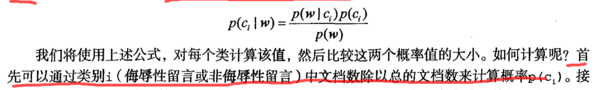
  
  * 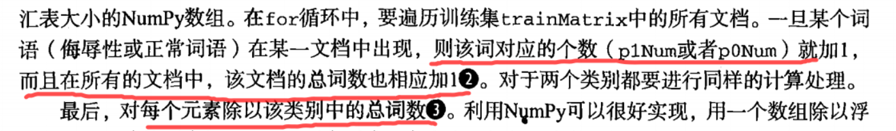

* 源代码
```python
'''
description: 朴素贝叶斯分类器训练函数
param {*} trainMatrix 训练文档矩阵,将listOposts通过setOfWords2Vec返回的returnVec构成的矩阵
param {*} trainCategory 训练类别标签向量,即loadDataSet返回的classVec
return {*} 	p0Vect - 非的条件概率数组
			p1Vect - 侮辱类的条件概率数组
			pAbusive - 文档属于侮辱类的概率
'''
def trainNB0(trainMatrix,trainCategory):
	numTrainDocs = len(trainMatrix)							#计算训练的文档数目
	numWords = len(trainMatrix[0])							#计算每篇文档的词条数
	pAbusive = sum(trainCategory)/float(numTrainDocs)		#文档属于侮辱类的概率
	p0Num = np.zeros(numWords); p1Num = np.zeros(numWords)	#创建numpy.zeros数组,
	p0Denom = 0.0; p1Denom = 0.0                        	#分母初始化为0.0
	for i in range(numTrainDocs):
		if trainCategory[i] == 1:							#统计属于侮辱类的条件概率所需的数据，即P(w0|1),P(w1|1),P(w2|1)···
			p1Num += trainMatrix[i]
			p1Denom += sum(trainMatrix[i])                  ## 该词条的总的词数目   这压样求得每个词条出现的概率 P(w1),P(w2), P(w3)...
		else:												#统计属于非侮辱类的条件概率所需的数据，即P(w0|0),P(w1|0),P(w2|0)···
			p0Num += trainMatrix[i]
			p0Denom += sum(trainMatrix[i])
	p1Vect = p1Num/p1Denom									#相除        
	p0Vect = p0Num/p0Denom          
	return p0Vect,p1Vect,pAbusive							#返回属于侮辱类的条件概率数组，属于非侮辱类的条件概率数组，文档属于侮辱类的概率

# test
listOposts,listClasses = loadDataSet()
myVocabList = createVocabList(listOposts)
trainMat = []
for postinDoc in listOposts:
	trainMat.append(setOfWords2Vec(myVocabList,postinDoc))
p0V,p1V,pAb = trainNB0(trainMat,listClasses)
print(pAb)
print(p0V)
print(p1V)

```

* 算法图

  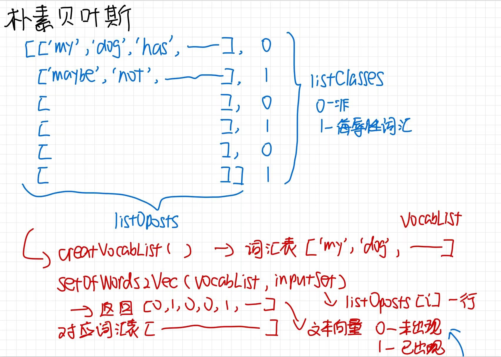
  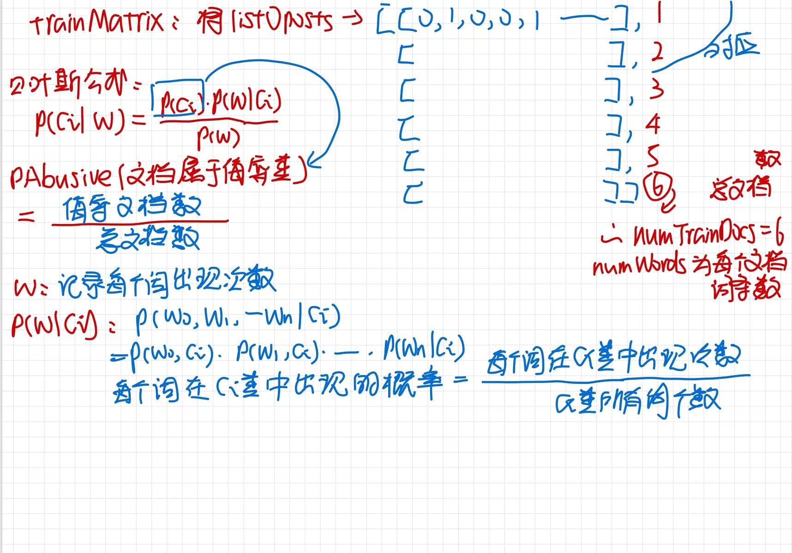
  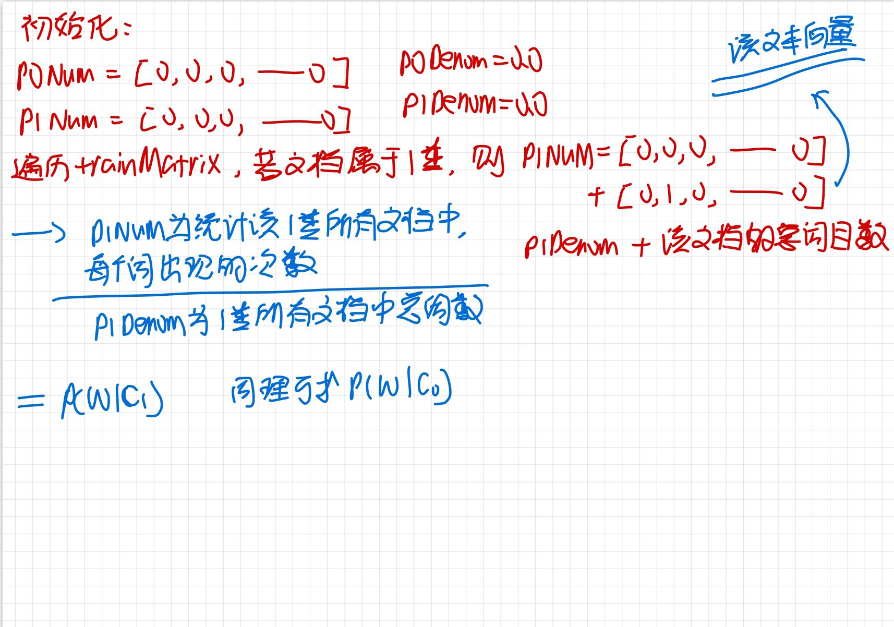
  
### 4.5.3 测试算法：根据现实情况修改分类器
* 目前问题

  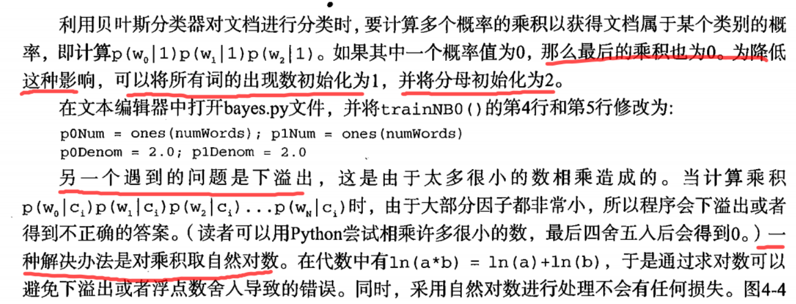

* 源代码
```python
'''
description: （修改后）朴素贝叶斯分类器训练函数
param {*} trainMatrix 训练文档矩阵,将listOposts通过setOfWords2Vec返回的returnVec构成的矩阵
param {*} trainCategory 训练类别标签向量,即loadDataSet返回的classVec
return {*} 	p0Vect - 非的条件概率数组
			p1Vect - 侮辱类的条件概率数组
			pAbusive - 文档属于侮辱类的概率
'''
def trainNB0(trainMatrix,trainCategory):
    numTrainDocs = len(trainMatrix)							#计算训练的文档数目
    numWords = len(trainMatrix[0])							#计算每篇文档的词条数
    pAbusive = sum(trainCategory)/float(numTrainDocs)		#文档属于侮辱类的概率
    p0Num = np.ones(numWords); p1Num = np.ones(numWords)	#创建numpy.ones数组,词条出现数初始化为1，拉普拉斯平滑
    p0Denom = 2.0; p1Denom = 2.0                        	#分母初始化为2,拉普拉斯平滑
    for i in range(numTrainDocs):
        if trainCategory[i] == 1:							#统计属于侮辱类的条件概率所需的数据，即P(w0|1),P(w1|1),P(w2|1)···
            p1Num += trainMatrix[i]
            p1Denom += sum(trainMatrix[i])
        else:												#统计属于非侮辱类的条件概率所需的数据，即P(w0|0),P(w1|0),P(w2|0)···
            p0Num += trainMatrix[i]
            p0Denom += sum(trainMatrix[i])
    p1Vect = np.log(p1Num/p1Denom)							#取对数，防止下溢出          
    p0Vect = np.log(p0Num/p0Denom)          
    return p0Vect,p1Vect,pAbusive							#返回属于侮辱类的条件概率数组，属于非侮辱类的条件概率数组，文档属于侮辱类的概率


'''
description: 朴素贝叶斯分类器分类函数
param {*} vec2Classify 待分类的词条数组
param {*} p0Vec 非侮辱类的条件概率数组
param {*} p1Vec 侮辱类的条件概率数组
param {*} pClass1 文档属于侮辱类的概率
return {*} 	0 - 属于非侮辱类
			1 - 属于侮辱类
'''
def classifyNB(vec2Classify, p0Vec, p1Vec, pClass1):
	# 两向量相乘相当于求解该测试文档的总P1Vec概率
    p1 = sum(vec2Classify * p1Vec) + np.log(pClass1)    	#对应元素相乘。logA * B = logA + logB，所以这里加上log(pClass1)
    p0 = sum(vec2Classify * p0Vec) + np.log(1.0 - pClass1)
    if p1 > p0: #不用除p(m)因为只用比较分子
        return 1
    else: 
        return 0


'''
description: 测试朴素贝叶斯分类器
return {*}
'''
def testingNB():
	listOPosts,listClasses = loadDataSet()									#创建实验样本
	myVocabList = createVocabList(listOPosts)								#创建词汇表
	trainMat=[]
	for postinDoc in listOPosts:
		trainMat.append(setOfWords2Vec(myVocabList, postinDoc))				#将实验样本向量化
	p0V,p1V,pAb = trainNB0(np.array(trainMat),np.array(listClasses))		#训练朴素贝叶斯分类器
	testEntry = ['love', 'my', 'dalmation']									#测试样本1
	thisDoc = np.array(setOfWords2Vec(myVocabList, testEntry))				#测试样本向量化
	if classifyNB(thisDoc,p0V,p1V,pAb):
		print(testEntry,'属于侮辱类')										#执行分类并打印分类结果
	else:
		print(testEntry,'属于非侮辱类')										#执行分类并打印分类结果
	testEntry = ['stupid', 'garbage']										#测试样本2

	thisDoc = np.array(setOfWords2Vec(myVocabList, testEntry))				#测试样本向量化
	if classifyNB(thisDoc,p0V,p1V,pAb):
		print(testEntry,'属于侮辱类')										#执行分类并打印分类结果
	else:
		print(testEntry,'属于非侮辱类')										#执行分类并打印分类结果

# test
testingNB()


```

### 4.5.4 准备数据：文档词袋模型
* 在词袋中，每个单词可以出现多次

* 源代码
```python
'''
description: 根据vocabList词汇表,构建词袋模型
param {*} vocabList createVocabList返回的列表
param {*} inputSet 切分的词条列表
return {*}
'''
def bagOfWords2VecMN(vocabList, inputSet):
    returnVec = [0]*len(vocabList)										#创建一个其中所含元素都为0的向量
    for word in inputSet:												#遍历每个词条
        if word in vocabList:											#如果词条存在于词汇表中，则计数加一
            returnVec[vocabList.index(word)] += 1
    return returnVec													#返回词袋模型


```


## 4.6 示例：使用朴素贝叶斯过滤垃圾邮件
* 一般流程

  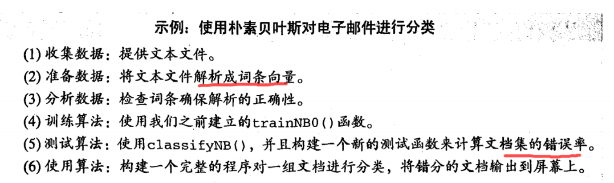

### 4.6.1 准备数据：切分文本
* 源代码
```python
'''
description: 接收一个大字符串并将其解析为字符串列表
param {*} bigString
return {*}
'''
def textParse(bigString):                                                   #将字符串转换为字符列表
    # * 会匹配0个或多个规则，split会将字符串分割成单个字符【python3.5+】; 这里使用\W 或者\W+ 都可以将字符数字串分割开，产生的空字符将会在后面的列表推导式中过滤掉
    listOfTokens = re.split(r'\W+', bigString)                              #将特殊符号作为切分标志进行字符串切分，即非字母、非数字
    return [tok.lower() for tok in listOfTokens if len(tok) > 2]            #除了单个字母，例如大写的I，其它单词变成小写


```

### 4.6.2 测试算法：使用朴素贝叶斯进行交叉验证
* 源代码
```python
'''
description: 测试朴素贝叶斯分类器
return {*}
'''
def spamTest():
    docList = []; classList = []; fullText = []
    for i in range(1, 26):                                                  #遍历25个txt文件
        wordList = textParse(open('email/spam/%d.txt' % i, 'r').read())     #读取每个垃圾邮件，并字符串转换成字符串列表
        docList.append(wordList)
        fullText.append(wordList)
        classList.append(1)                                                 #标记垃圾邮件，1表示垃圾文件
        wordList = textParse(open('email/ham/%d.txt' % i, 'r').read())      #读取每个非垃圾邮件，并字符串转换成字符串列表
        docList.append(wordList)
        fullText.append(wordList)
        classList.append(0)                                                 #标记非垃圾邮件，1表示垃圾文件    
    vocabList = createVocabList(docList)                                    #创建词汇表，不重复
    trainingSet = list(range(50)); testSet = []                             #创建存储训练集的索引值的列表和测试集的索引值的列表                        
    for i in range(10):                                                     #从50个邮件中，随机挑选出40个作为训练集,10个做测试集
        randIndex = int(random.uniform(0, len(trainingSet)))                #随机选取索索引值
        testSet.append(trainingSet[randIndex])                              #添加测试集的索引值
        del(trainingSet[randIndex])                                         #在训练集列表中删除添加到测试集的索引值
    trainMat = []; trainClasses = []                                        #创建训练集矩阵和训练集类别标签系向量             
    for docIndex in trainingSet:                                            #遍历训练集
        trainMat.append(setOfWords2Vec(vocabList, docList[docIndex]))       #将生成的词集模型添加到训练矩阵中
        trainClasses.append(classList[docIndex])                            #将类别添加到训练集类别标签系向量中
    p0V, p1V, pSpam = trainNB0(np.array(trainMat), np.array(trainClasses))  #训练朴素贝叶斯模型
    errorCount = 0                                                          #错误分类计数
    for docIndex in testSet:                                                #遍历测试集
        wordVector = setOfWords2Vec(vocabList, docList[docIndex])           #测试集的词集模型
        if classifyNB(np.array(wordVector), p0V, p1V, pSpam) != classList[docIndex]:    #如果分类错误
            errorCount += 1                                                 #错误计数加1
            print("分类错误的测试集：",docList[docIndex])
    print('错误率：%.2f%%' % (float(errorCount) / len(testSet) * 100))


# test
spamTest()
spamTest()
spamTest()

```


## 4.8 本章小结

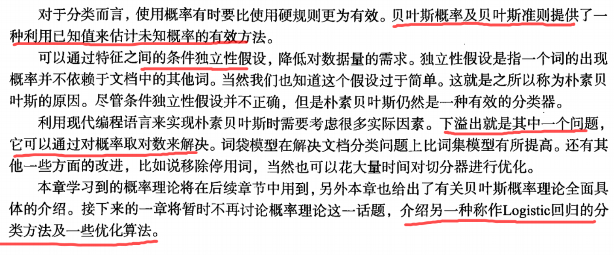

