# 第五章  Logistic回归
* **利用Logistic回归进行分类的主要思想：**
  根据现有数据对分类边界线建立回归公式，以此进行分类。

* 一般过程

  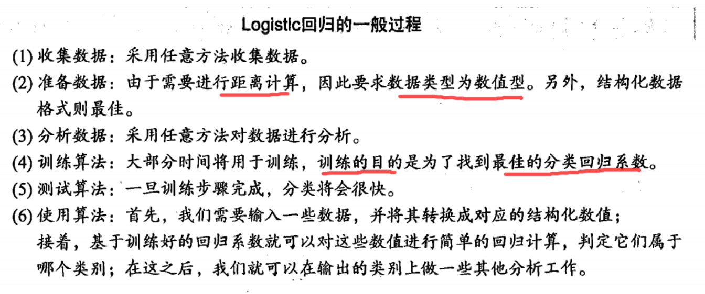


## 5.1 基于Logistic回归和Sigmoid函数的分类
* Logistic回归

  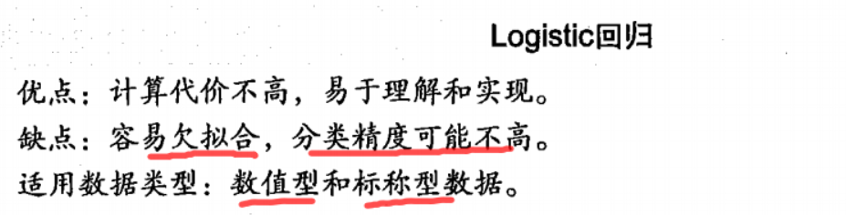

* Sigmoid函数
  * 计算公式
  
    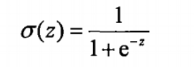
    
  * 函数图像
  
    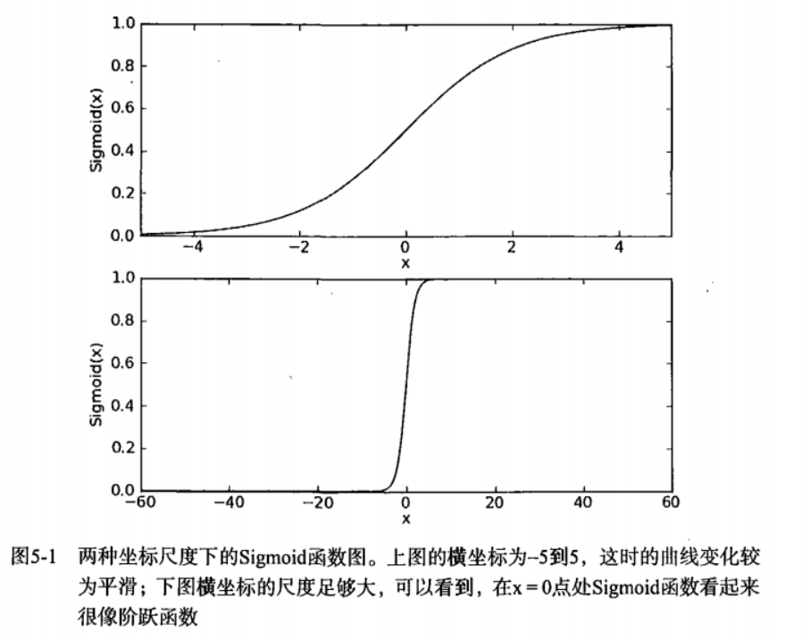

* 因此为了实现Logistic回归分类器，我们可以在每个特征上都乘以一个回归系数，然后把所有的结果值相加，将这个总和代入Sigmoid函数中，**进而得到一个范围在0-1之间的数值**。任何大于0.5的数据被分入1类，小于0.5即被归入0类。所以，Logistic回归也可以被看成一种概率估计。


## 5.2 基于最优化方法的最佳回归系数确定
* 基本工作

  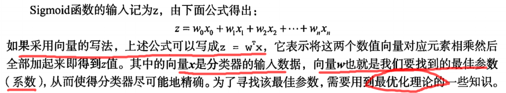

### 5.2.1 梯度上升法
* 梯度上升法（最优化算法）
  * 基于的思想：要找到某函数的最大值，最好的方法是**沿着该函数的梯度方向**探寻。

* f(x,y)梯度公式

  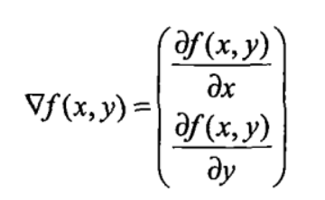
  
  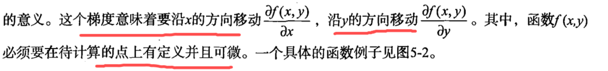

  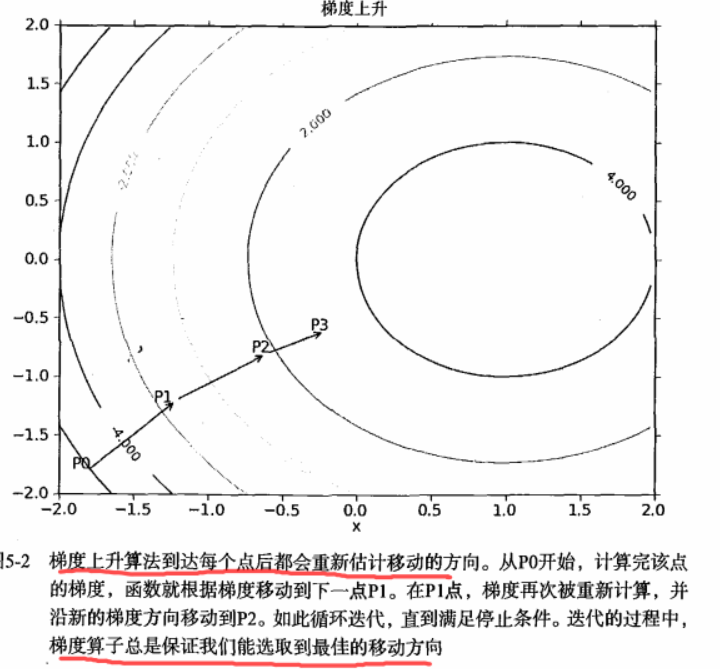

  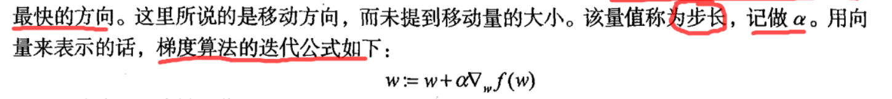

* **梯度上升算法**用来求函数的**最大值**
* **梯度下降算法**用来求函数的**最小值**

### 5.2.2 训练算法：使用梯度上升找到最佳参数
* 数据集例图

  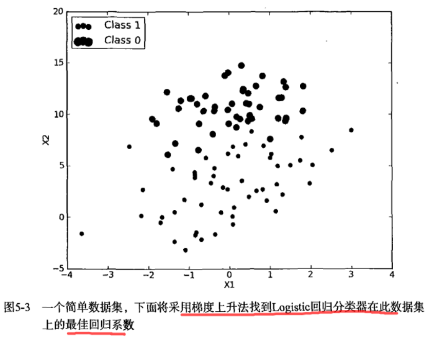

* 伪代码

  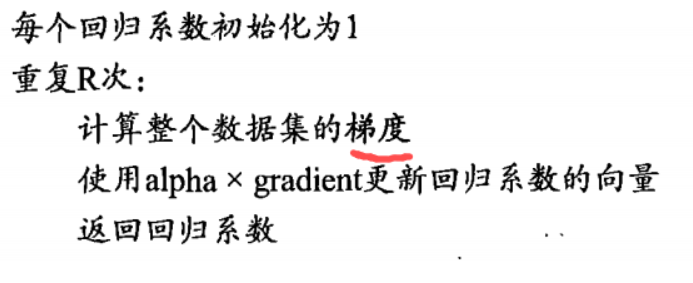

* 源代码
```python
'''
Author: PuPuoo
Date: 2023-04-19 15:56:54
LastEditors: PuPuoo
LastEditTime: 2023-04-19 16:15:28
FilePath: \05-Logistic回归\logRegres.py
Description: Logistic回归
'''

import numpy as np


'''
description: 加载数据
return {*}
'''
def loadDataSet():
	dataMat = []														#创建数据列表
	labelMat = []														#创建标签列表
	fr = open('testSet.txt')											#打开文件	
	for line in fr.readlines():											#逐行读取
		lineArr = line.strip().split()									#去回车，放入列表
		dataMat.append([1.0, float(lineArr[0]), float(lineArr[1])])		#添加数据
		labelMat.append(int(lineArr[2]))								#添加标签
	fr.close()															#关闭文件
	return dataMat, labelMat											#返回


'''
description: sigmoid函数
param {*} inX 数据
return {*}
'''
def sigmoid(inx):
    if inx>=0:      #对sigmoid函数的优化，避免了出现极大的数据溢出
        return 1.0/(1+np.exp(-inx))
    else:
        return np.exp(inx)/(1+np.exp(inx))


'''
description: 梯度上升算法
param {*} dataMatIn 数据集
param {*} classLabels 数据标签
return {*} weights.getA() - 求得的权重数组(最优参数)
'''
def gradAscent(dataMatIn, classLabels):
	dataMatrix = np.mat(dataMatIn)										#转换成numpy的mat
	labelMat = np.mat(classLabels).transpose()							#转换成numpy的mat,并进行转置
	m, n = np.shape(dataMatrix)											#返回dataMatrix的大小。m为行数,n为列数。
	alpha = 0.001														#移动步长,也就是学习速率,控制更新的幅度。
	maxCycles = 500														#最大迭代次数
	weights = np.ones((n,1))
	for k in range(maxCycles):
		h = sigmoid(dataMatrix * weights)								#梯度上升矢量化公式
		error = labelMat - h        #计算真实类别与预测类别的差值，接下来就是按照该差值的方向调整回归系数
		weights = weights + alpha * dataMatrix.transpose() * error
	return weights.getA()												#将矩阵转换为数组，返回权重数组

# test
dataArr,labelMat = loadDataSet()
print(gradAscent(dataArr,labelMat))

```

### 5.2.3 分析数据：画出决策边界
* 源代码
```python
'''
description: 绘制数据集
param {*} weights 权重参数数组
return {*}
'''
def plotBestFit(weights):
	dataMat, labelMat = loadDataSet()									#加载数据集
	dataArr = np.array(dataMat)											#转换成numpy的array数组
	n = np.shape(dataMat)[0]											#数据个数
	xcord1 = []; ycord1 = []											#正样本
	xcord2 = []; ycord2 = []											#负样本
	for i in range(n):													#根据数据集标签进行分类
		if int(labelMat[i]) == 1:
			xcord1.append(dataArr[i,1]); ycord1.append(dataArr[i,2])	#1为正样本
		else:
			xcord2.append(dataArr[i,1]); ycord2.append(dataArr[i,2])	#0为负样本
	fig = plt.figure()
	ax = fig.add_subplot(111)											#添加subplot
	ax.scatter(xcord1, ycord1, s = 20, c = 'red', marker = 's',alpha=.5)#绘制正样本
	ax.scatter(xcord2, ycord2, s = 20, c = 'green',alpha=.5)			#绘制负样本
	x = np.arange(-3.0, 3.0, 0.1)
	y = (-weights[0] - weights[1] * x) / weights[2]                     #0为量给分类的分界处，因为x=0时sigmoid=0.5
                                                                        #所以设定w0x0+w1x1+w2x2=0 ,x0=1 从而解出x1与x2的关系式
	ax.plot(x, y)
	plt.title('BestFit')												#绘制title
	plt.xlabel('X1'); plt.ylabel('X2')									#绘制label
	plt.show()		

# test
dataMat, labelMat = loadDataSet()	
weights = gradAscent(dataMat, labelMat)
plotBestFit(weights)

```

* 效果图

  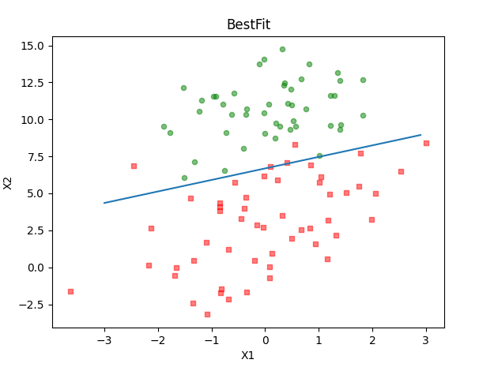

### 5.2.4 训练算法：随机梯度上升
* 梯度上升算法在每次更新回归系数时都需要遍历整个数据集，该方法在处理100个左右的数据集时尚可，但如果有数十亿样本和成千上万的特征，那么**该方法的计算复杂度就太高了**。一种改进方法是一次仅用一个样本点来更新回归系数，该方法称为**随机梯度上升算法**。

* 源代码
```python
'''
description: 改进的随机梯度上升算法
param {*} dataMatrix 数据数组
param {*} classLabels 数据标签
param {*} numIter 迭代次数
return {*} weights - 求得的回归系数数组(最优参数)
	       
'''
def stocGradAscent1(dataMatrix, classLabels, numIter=150):
	m,n = np.shape(dataMatrix)												#返回dataMatrix的大小。m为行数,n为列数。
	weights = np.ones(n)   													#参数初始化			#存储每次更新的回归系数
	for j in range(numIter):											
		dataIndex = list(range(m))
		for i in range(m):			
			alpha = 4/(1.0+j+i)+0.01   	 									#降低alpha的大小，每次减小1/(j+i)。
			randIndex = int(random.uniform(0,len(dataIndex)))				#随机选取样本
			h = sigmoid(sum(dataMatrix[randIndex]*weights))					#选择随机选取的一个样本，计算h
			error = classLabels[randIndex] - h 								#计算误差
			weights = weights + alpha * error * dataMatrix[randIndex]   	#更新回归系数
			del(dataIndex[randIndex]) 										#删除已经使用的样本
	return weights 															#返回

# test
dataMat, labelMat = loadDataSet()	
weights1,weights_array1 = stocGradAscent1(np.array(dataMat),labelMat)
plotBestFit(weights1)


```

* 效果图

  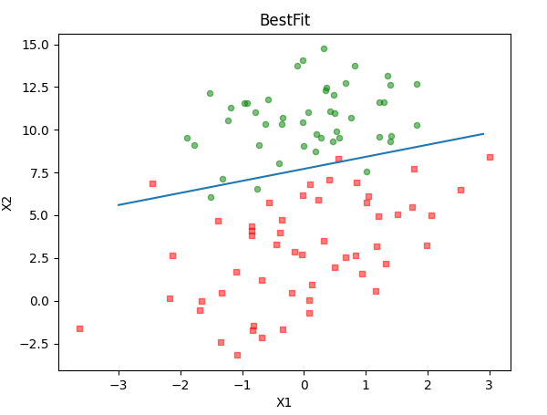


## 5.3 示例：从疝气病症预测病马的死亡率
* 一般流程

  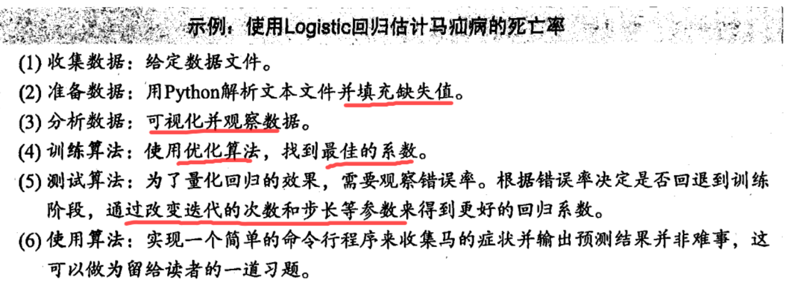

### 5.3.1 准备数据：处理数据中的缺失值
* 处理缺失值的方法

  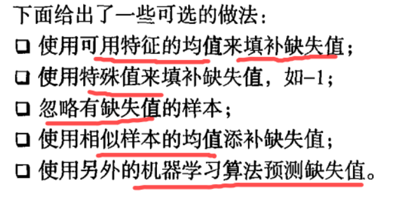

* 本节选**用特殊值来处理缺失值**，选择实数0来替换所有缺失值，这样更新时不会影响系数的值：
  * weights = weights + alpha * error * dataMatrix[randIndex]
  * 如果dataMatrix中某特征对应值为0，那么该特征的系数将不做更新 weights = weights 
* 并且sigmoid(0)=0.5 即它对结果的预测不具有任何倾向性
* 如果在测试数据集中发现了一条数据的类别标签已经缺失，我们的简单做法是**将该条数据丢弃**

### 5.3.2 测试算法：用Logistic回归进行分类
* 使用Logistic回归方法进行分类不需要做很多工作，**所需要做的只是把测试集**上每个特征向量乘以最优化方法得来的回归系数，再将该乘积结果求和，最后输入到Sigmoid函数中即可。如果对应的Sigmoid值大于0.5就预测类别标签为1，否则为0

* 源代码
```python
'''
description: 分类函数
param {*} inX 特征向量
param {*} weights 回归系数
return {*}
'''
def classifyVector(inX, weights):
    prob = sigmoid(sum(inX*weights))
    if prob > 0.5: return 1.0
    else: return 0.0


'''
description: 使用Python写的Logistic分类器做预测
return {*} 
'''
def colicTest():
	frTrain = open('horseColicTraining.txt')										#打开训练集
	frTest = open('horseColicTest.txt')												#打开测试集
	trainingSet = []; trainingLabels = []
	for line in frTrain.readlines():
		currLine = line.strip().split('\t')
		lineArr = []
		for i in range(len(currLine)-1):
			lineArr.append(float(currLine[i]))
		trainingSet.append(lineArr)
		trainingLabels.append(float(currLine[-1]))
	trainWeights = stocGradAscent1(np.array(trainingSet), trainingLabels,500)		#使用改进的随即上升梯度训练
	errorCount = 0; numTestVec = 0.0
	for line in frTest.readlines():
		numTestVec += 1.0
		currLine = line.strip().split('\t')
		lineArr =[]
		for i in range(len(currLine)-1):
			lineArr.append(float(currLine[i]))
		if int(classifyVector(np.array(lineArr), trainWeights))!= int(currLine[-1]):
			errorCount += 1
	errorRate = (float(errorCount)/numTestVec)								#错误率计算
	print("测试集错误率为: %.2f" % errorRate)
	return errorRate

# test
def multiTest():
	numTests = 10
	errorSum = 0.0
	for k in range(numTests):
		errorSum += colicTest()
	print("%d次之后的平均错误率为:%.2f" % (numTests,errorSum/float(numTests)))

multiTest()

```


## 5.4 本章小结

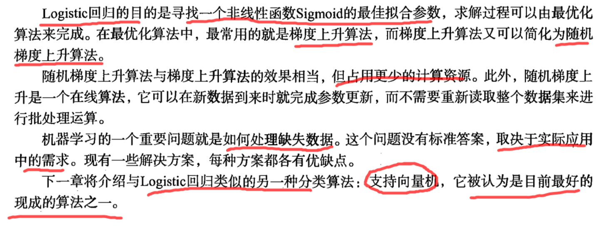


