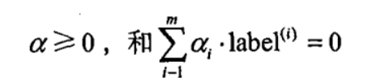

# 第六章  支持向量机
* 支持向量机（SVM）
* 在决定分离超平面时只有支持向量起作用，而其他实例点并不起作用。**支持向量在确定分离超平面中起着决定性作用，所以将这种分类模型称为支持向量机。**向量的个数一般很少，所以支持向量机由很少的“重要的”训练样本确定。

* 本章用**序列最小优化（SMO）**算法来实现

  

## 6.1 基于最大间隔分隔数据
* 重要概念
  * **线性可分**：能用一条直线将两组数据分开，这样的数据被称为线性可分。
  * **分隔超平面**：上述将数据集分隔开来的直线被称为分隔超平面。
  * **超平面**：N维数据集能用N-1维的某某对象来对数据进行分隔，该对象称为超平面。
  * **间隔**：点到分隔面的距离*2。
  * **间隔最大化**：对训练数据集找到几何间隔最大的超平面意味着以充分大的确信度对训练数据进行分类。也就是说，不仅将正负实例点分开，而且对最难分的实例点（离超平面最近的点）也有足够大的确信度将它们分开，这样的超平面应该对未知的新实例有很好的分类预测能力。
  * **支持向量**：离分隔超平面最近的那些点。

* 数学原理推导过程

  见ipad《机器学习》笔记


## 6.2 寻找最大间隔
### 6.2.1 分类器求解的优化问题
* 重要概念

  
  
  类别标签采用-1和+1

* 现在的目标是找到分类器定义中的w和b，为此我们必须找到具有最小间隔的数据点即支持向量，**一旦找到具有最小间隔的数据点，我们就需要对该间隔最大化**：

  

* **优化后的目标函数为**：

  

  
  
* 约束条件为：

  

  但是上述的假设是：数据必须100%线性可分，这时我们可以通过引入所谓的**松弛变量**，来允许有些数据点可以处于分隔面的错误一侧

* 从而**新的约束条件为**：

  
  
  这里的**常数C**用于控制“最大化间隔”和“保证大部分点的函数间隔小于1.0”这两个目标的权重。
  在优化算法的实现代码中，常数C是一个参数，因此我们就可以通过调节该参数得到不同的结果。一旦求出了所有的alpha，那么分隔超平面就可以通过这些alpha来表达。SVM的主要工作就是求解这些alpha。
  ***注：alpha是拉格朗日乘子***
  
### 6.2.2 SVM应用的一般框架
* 一般流程

  

## 6.3 SMO高效优化算法
* 本节我们对上一节中两个式子进行优化：

  

  

  


* 所有需要围绕优化做的事情就是训练分类器，一旦得到alpha的最优值，我们就得到了分隔超平面，并能够将之用于数据分类。

### 6.3.1 Platt的SMO算法
* SMO算法，用于训练SVM

* SMO表示序列最小优化，将**大优化问题分解成多个小优化问题来求解**。这些小优化问题往往很容易求解，并且对它们进行顺序求解的结果与将它们作为整体来求解的**结果是完全一致的**。在结果完全相同的同时，**SMO算法的求解时间短很多**。

* 工作原理：

  

* 算法目标：
	求出一系列alpha和b，一旦求出了这些alpha，就很容易计算出权重向量w，并得到分割超平面。

### 6.3.2 应用简化版SMO算法处理小规模数据集
* 简化版工作原理

  

* 伪代码

  

  

* 源代码
```python
'''
description: 简化版SMO算法
param {*} dataMatIn 数据矩阵
param {*} classLabels 数据标签
param {*} C 松弛变量
param {*} toler 容错率
param {*} maxIter 最大迭代次数
return {*}
'''
def smoSimple(dataMatIn, classLabels, C, toler, maxIter):
	#转换为numpy的mat存储
	dataMatrix = np.mat(dataMatIn); labelMat = np.mat(classLabels).transpose()
	#初始化b参数，统计dataMatrix的维度
	b = 0; m,n = np.shape(dataMatrix)
	#初始化alpha参数，设为0
	alphas = np.mat(np.zeros((m,1)))
	#初始化迭代次数
	iter_num = 0
	#最多迭代matIter次
	while (iter_num < maxIter):
		alphaPairsChanged = 0
		for i in range(m):
			#步骤1：计算误差Ei
			fXi = float(np.multiply(alphas,labelMat).T*(dataMatrix*dataMatrix[i,:].T)) + b
			Ei = fXi - float(labelMat[i])
			#优化alpha，设定一定的容错率。
			if ((labelMat[i]*Ei < -toler) and (alphas[i] < C)) or ((labelMat[i]*Ei > toler) and (alphas[i] > 0)):
				#随机选择另一个与alpha_i成对优化的alpha_j
				j = selectJrand(i,m)
				#步骤1：计算误差Ej
				fXj = float(np.multiply(alphas,labelMat).T*(dataMatrix*dataMatrix[j,:].T)) + b
				Ej = fXj - float(labelMat[j])
				#保存更新前的aplpha值，使用深拷贝
				alphaIold = alphas[i].copy()
				alphaJold = alphas[j].copy()
				#步骤2：计算上下界L和H
				if (labelMat[i] != labelMat[j]):
					L = max(0, alphas[j] - alphas[i])
					H = min(C, C + alphas[j] - alphas[i])
				else:
					L = max(0, alphas[j] + alphas[i] - C)
					H = min(C, alphas[j] + alphas[i])
				if L==H: print("L==H"); continue
				#步骤3：计算eta
				eta = 2.0 * dataMatrix[i,:]*dataMatrix[j,:].T - dataMatrix[i,:]*dataMatrix[i,:].T - dataMatrix[j,:]*dataMatrix[j,:].T
				if eta >= 0: print("eta>=0"); continue
				#步骤4：更新alpha_j
				alphas[j] -= labelMat[j]*(Ei - Ej)/eta
				#步骤5：修剪alpha_j
				alphas[j] = clipAlpha(alphas[j],H,L)
				if (abs(alphas[j] - alphaJold) < 0.00001): print("alpha_j变化太小"); continue
				#步骤6：更新alpha_i
				alphas[i] += labelMat[j]*labelMat[i]*(alphaJold - alphas[j])
				#步骤7：更新b_1和b_2
				b1 = b - Ei- labelMat[i]*(alphas[i]-alphaIold)*dataMatrix[i,:]*dataMatrix[i,:].T - labelMat[j]*(alphas[j]-alphaJold)*dataMatrix[i,:]*dataMatrix[j,:].T
				b2 = b - Ej- labelMat[i]*(alphas[i]-alphaIold)*dataMatrix[i,:]*dataMatrix[j,:].T - labelMat[j]*(alphas[j]-alphaJold)*dataMatrix[j,:]*dataMatrix[j,:].T
				#步骤8：根据b_1和b_2更新b
				if (0 < alphas[i]) and (C > alphas[i]): b = b1
				elif (0 < alphas[j]) and (C > alphas[j]): b = b2
				else: b = (b1 + b2)/2.0
				#统计优化次数
				alphaPairsChanged += 1
				#打印统计信息
				print("第%d次迭代 样本:%d, alpha优化次数:%d" % (iter_num,i,alphaPairsChanged))
		#更新迭代次数
		if (alphaPairsChanged == 0): iter_num += 1
		else: iter_num = 0
		print("迭代次数: %d" % iter_num)
	return b,alphas

# test
dataArr,labelArr = loadDataSet('testSet.txt')
b,alphas = smoSimple(dataArr,labelArr,0.6,0.001,40)
print(b)
print(alphas[alphas>0])
print("支持向量的个数为：")
print(np.shape(alphas[alphas>0]))

```


## 6.4 利用完整Platt SMO算法加速优化
* 源代码
```python
class optStruct:
	"""
	数据结构，维护所有需要操作的值
	Parameters：
		dataMatIn - 数据矩阵
		classLabels - 数据标签
		C - 松弛变量
		toler - 容错率
	"""
	def __init__(self, dataMatIn, classLabels, C, toler):
		self.X = dataMatIn								#数据矩阵
		self.labelMat = classLabels						#数据标签
		self.C = C 										#松弛变量
		self.tol = toler 								#容错率
		self.m = np.shape(dataMatIn)[0] 				#数据矩阵行数
		self.alphas = np.mat(np.zeros((self.m,1))) 		#根据矩阵行数初始化alpha参数为0	
		self.b = 0 										#初始化b参数为0
		self.eCache = np.mat(np.zeros((self.m,2))) 		#根据矩阵行数初始化虎误差缓存，第一列为是否有效的标志位，第二列为实际的误差E的值。

def loadDataSet(fileName):
	"""
	读取数据
	Parameters:
	    fileName - 文件名
	Returns:
	    dataMat - 数据矩阵
	    labelMat - 数据标签
	"""
	dataMat = []; labelMat = []
	fr = open(fileName)
	for line in fr.readlines():                                     #逐行读取，滤除空格等
		lineArr = line.strip().split('\t')
		dataMat.append([float(lineArr[0]), float(lineArr[1])])      #添加数据
		labelMat.append(float(lineArr[2]))                          #添加标签
	return dataMat,labelMat

def calcEk(oS, k):
	"""
	计算误差
	Parameters：
		oS - 数据结构
		k - 标号为k的数据
	Returns:
	    Ek - 标号为k的数据误差
	"""
	fXk = float(np.multiply(oS.alphas,oS.labelMat).T*(oS.X*oS.X[k,:].T) + oS.b)
	Ek = fXk - float(oS.labelMat[k])
	return Ek

def selectJrand(i, m):
	"""
	函数说明:随机选择alpha_j的索引值

	Parameters:
	    i - alpha_i的索引值
	    m - alpha参数个数
	Returns:
	    j - alpha_j的索引值
	"""
	j = i                                 #选择一个不等于i的j
	while (j == i):
		j = int(random.uniform(0, m))
	return j

def selectJ(i, oS, Ei):
	"""
	内循环启发方式2
	Parameters：
		i - 标号为i的数据的索引值
		oS - 数据结构
		Ei - 标号为i的数据误差
	Returns:
	    j, maxK - 标号为j或maxK的数据的索引值
	    Ej - 标号为j的数据误差
	"""
	maxK = -1; maxDeltaE = 0; Ej = 0 						#初始化
	oS.eCache[i] = [1,Ei]  									#根据Ei更新误差缓存
	validEcacheList = np.nonzero(oS.eCache[:,0].A)[0]		#返回误差不为0的数据的索引值
	if (len(validEcacheList)) > 1:							#有不为0的误差
		for k in validEcacheList:   						#遍历,找到最大的Ek
			if k == i: continue 							#不计算i,浪费时间
			Ek = calcEk(oS, k)								#计算Ek
			deltaE = abs(Ei - Ek)							#计算|Ei-Ek|
			if (deltaE > maxDeltaE):						#找到maxDeltaE
				maxK = k; maxDeltaE = deltaE; Ej = Ek
		return maxK, Ej										#返回maxK,Ej
	else:   												#没有不为0的误差
		j = selectJrand(i, oS.m)							#随机选择alpha_j的索引值
		Ej = calcEk(oS, j)									#计算Ej
	return j, Ej 											#j,Ej

def updateEk(oS, k):
	"""
	计算Ek,并更新误差缓存
	Parameters：
		oS - 数据结构
		k - 标号为k的数据的索引值
	Returns:
		无
	"""
	Ek = calcEk(oS, k)										#计算Ek
	oS.eCache[k] = [1,Ek]									#更新误差缓存


def clipAlpha(aj,H,L):
	"""
	修剪alpha_j
	Parameters:
	    aj - alpha_j的值
	    H - alpha上限
	    L - alpha下限
	Returns:
	    aj - 修剪后的alpah_j的值
	"""
	if aj > H: 
		aj = H
	if L > aj:
		aj = L
	return aj

def innerL(i, oS):
	"""
	优化的SMO算法
	Parameters：
		i - 标号为i的数据的索引值
		oS - 数据结构
	Returns:
		1 - 有任意一对alpha值发生变化
		0 - 没有任意一对alpha值发生变化或变化太小
	"""
	#步骤1：计算误差Ei
	Ei = calcEk(oS, i)
	#优化alpha,设定一定的容错率。
	if ((oS.labelMat[i] * Ei < -oS.tol) and (oS.alphas[i] < oS.C)) or ((oS.labelMat[i] * Ei > oS.tol) and (oS.alphas[i] > 0)):
		#使用内循环启发方式2选择alpha_j,并计算Ej
		j,Ej = selectJ(i, oS, Ei)
		#保存更新前的aplpha值，使用深拷贝
		alphaIold = oS.alphas[i].copy(); alphaJold = oS.alphas[j].copy();
		#步骤2：计算上下界L和H
		if (oS.labelMat[i] != oS.labelMat[j]):
			L = max(0, oS.alphas[j] - oS.alphas[i])
			H = min(oS.C, oS.C + oS.alphas[j] - oS.alphas[i])
		else:
			L = max(0, oS.alphas[j] + oS.alphas[i] - oS.C)
			H = min(oS.C, oS.alphas[j] + oS.alphas[i])
		if L == H: 
			print("L==H")
			return 0
		#步骤3：计算eta
		eta = 2.0 * oS.X[i,:] * oS.X[j,:].T - oS.X[i,:] * oS.X[i,:].T - oS.X[j,:] * oS.X[j,:].T
		if eta >= 0: 
			print("eta>=0")
			return 0
		#步骤4：更新alpha_j
		oS.alphas[j] -= oS.labelMat[j] * (Ei - Ej)/eta
		#步骤5：修剪alpha_j
		oS.alphas[j] = clipAlpha(oS.alphas[j],H,L)
		#更新Ej至误差缓存
		updateEk(oS, j)
		if (abs(oS.alphas[j] - alphaJold) < 0.00001): 
			print("alpha_j变化太小")
			return 0
		#步骤6：更新alpha_i
		oS.alphas[i] += oS.labelMat[j]*oS.labelMat[i]*(alphaJold - oS.alphas[j])
		#更新Ei至误差缓存
		updateEk(oS, i)
		#步骤7：更新b_1和b_2
		b1 = oS.b - Ei- oS.labelMat[i]*(oS.alphas[i]-alphaIold)*oS.X[i,:]*oS.X[i,:].T - oS.labelMat[j]*(oS.alphas[j]-alphaJold)*oS.X[i,:]*oS.X[j,:].T
		b2 = oS.b - Ej- oS.labelMat[i]*(oS.alphas[i]-alphaIold)*oS.X[i,:]*oS.X[j,:].T - oS.labelMat[j]*(oS.alphas[j]-alphaJold)*oS.X[j,:]*oS.X[j,:].T
		#步骤8：根据b_1和b_2更新b
		if (0 < oS.alphas[i]) and (oS.C > oS.alphas[i]): oS.b = b1
		elif (0 < oS.alphas[j]) and (oS.C > oS.alphas[j]): oS.b = b2
		else: oS.b = (b1 + b2)/2.0
		return 1
	else: 
		return 0

def smoP(dataMatIn, classLabels, C, toler, maxIter):
	"""
	完整的线性SMO算法
	Parameters：
		dataMatIn - 数据矩阵
		classLabels - 数据标签
		C - 松弛变量
		toler - 容错率
		maxIter - 最大迭代次数
	Returns:
		oS.b - SMO算法计算的b
		oS.alphas - SMO算法计算的alphas
	"""
	oS = optStruct(np.mat(dataMatIn), np.mat(classLabels).transpose(), C, toler)					#初始化数据结构
	iter = 0 																						#初始化当前迭代次数
	entireSet = True; alphaPairsChanged = 0
	while (iter < maxIter) and ((alphaPairsChanged > 0) or (entireSet)):							#遍历整个数据集都alpha也没有更新或者超过最大迭代次数,则退出循环
		alphaPairsChanged = 0
		if entireSet:																				#遍历整个数据集   						
			for i in range(oS.m):        
				alphaPairsChanged += innerL(i,oS)													#使用优化的SMO算法
				print("全样本遍历:第%d次迭代 样本:%d, alpha优化次数:%d" % (iter,i,alphaPairsChanged))
			iter += 1
		else: 																						#遍历非边界值
			nonBoundIs = np.nonzero((oS.alphas.A > 0) * (oS.alphas.A < C))[0]						#遍历不在边界0和C的alpha
			for i in nonBoundIs:
				alphaPairsChanged += innerL(i,oS)
				print("非边界遍历:第%d次迭代 样本:%d, alpha优化次数:%d" % (iter,i,alphaPairsChanged))
			iter += 1
		if entireSet:																				#遍历一次后改为非边界遍历
			entireSet = False
		elif (alphaPairsChanged == 0):																#如果alpha没有更新,计算全样本遍历 
			entireSet = True  
		print("迭代次数: %d" % iter)
	return oS.b,oS.alphas 																			#返回SMO算法计算的b和alphas


def showClassifer(dataMat, classLabels, w, b):
	"""
	分类结果可视化
	Parameters:
		dataMat - 数据矩阵
	    w - 直线法向量
	    b - 直线解决
	Returns:
	    无
	"""
	#绘制样本点
	data_plus = []                                  #正样本
	data_minus = []                                 #负样本
	for i in range(len(dataMat)):
		if classLabels[i] > 0:
			data_plus.append(dataMat[i])
		else:
			data_minus.append(dataMat[i])
	data_plus_np = np.array(data_plus)              #转换为numpy矩阵
	data_minus_np = np.array(data_minus)            #转换为numpy矩阵
	plt.scatter(np.transpose(data_plus_np)[0], np.transpose(data_plus_np)[1], s=30, alpha=0.7)   #正样本散点图
	plt.scatter(np.transpose(data_minus_np)[0], np.transpose(data_minus_np)[1], s=30, alpha=0.7) #负样本散点图
	#绘制直线
	x1 = max(dataMat)[0]
	x2 = min(dataMat)[0]
	a1, a2 = w
	b = float(b)
	a1 = float(a1[0])
	a2 = float(a2[0])
	y1, y2 = (-b- a1*x1)/a2, (-b - a1*x2)/a2
	plt.plot([x1, x2], [y1, y2])
	#找出支持向量点
	for i, alpha in enumerate(alphas):
		if alpha > 0:
			x, y = dataMat[i]
			plt.scatter([x], [y], s=150, c='none', alpha=0.7, linewidth=1.5, edgecolor='red')
	plt.show()


def calcWs(alphas,dataArr,classLabels):
	"""
	计算w
	Parameters:
		dataArr - 数据矩阵
	    classLabels - 数据标签
	    alphas - alphas值
	Returns:
	    w - 计算得到的w
	"""
	X = np.mat(dataArr); labelMat = np.mat(classLabels).transpose()
	m,n = np.shape(X)
	w = np.zeros((n,1))
	for i in range(m):
		w += np.multiply(alphas[i]*labelMat[i],X[i,:].T)
	return w

if __name__ == '__main__':
	dataArr, classLabels = loadDataSet('testSet.txt')
	b, alphas = smoP(dataArr, classLabels, 0.6, 0.001, 40)
	w = calcWs(alphas,dataArr, classLabels)
	showClassifer(dataArr, classLabels, w, b)

```

* 效果图

  


## 6.5 在复杂数据上应用核函数
* 源代码
```python
'''
Author: PuPuoo
Date: 2023-04-25 17:22:51
LastEditors: PuPuoo
LastEditTime: 2023-04-25 17:35:49
FilePath: \06-支持向量机\svmDigits.py
Description: 非线性支持向量机
'''
# -*-coding:utf-8 -*-
import matplotlib.pyplot as plt
import numpy as np
import random


class optStruct:
	"""
	数据结构，维护所有需要操作的值
	Parameters：
		dataMatIn - 数据矩阵
		classLabels - 数据标签
		C - 松弛变量
		toler - 容错率
		kTup - 包含核函数信息的元组,第一个参数存放核函数类别，第二个参数存放必要的核函数需要用到的参数
	"""
	def __init__(self, dataMatIn, classLabels, C, toler, kTup):
		self.X = dataMatIn								#数据矩阵
		self.labelMat = classLabels						#数据标签
		self.C = C 										#松弛变量
		self.tol = toler 								#容错率
		self.m = np.shape(dataMatIn)[0] 				#数据矩阵行数
		self.alphas = np.mat(np.zeros((self.m,1))) 		#根据矩阵行数初始化alpha参数为0	
		self.b = 0 										#初始化b参数为0
		self.eCache = np.mat(np.zeros((self.m,2))) 		#根据矩阵行数初始化虎误差缓存，第一列为是否有效的标志位，第二列为实际的误差E的值。
		self.K = np.mat(np.zeros((self.m,self.m)))		#初始化核K
		for i in range(self.m):							#计算所有数据的核K
			self.K[:,i] = kernelTrans(self.X, self.X[i,:], kTup)

def kernelTrans(X, A, kTup): 
	"""
	通过核函数将数据转换更高维的空间
	Parameters：
		X - 数据矩阵
		A - 单个数据的向量
		kTup - 包含核函数信息的元组
	Returns:
	    K - 计算的核K
	"""
	m,n = np.shape(X)
	K = np.mat(np.zeros((m,1)))
	if kTup[0] == 'lin': K = X * A.T   					#线性核函数,只进行内积。
	elif kTup[0] == 'rbf': 								#高斯核函数,根据高斯核函数公式进行计算
		for j in range(m):
			deltaRow = X[j,:] - A
			K[j] = deltaRow*deltaRow.T
		K = np.exp(K/(-1*kTup[1]**2)) 					#计算高斯核K
	else: raise NameError('核函数无法识别')
	return K 											#返回计算的核K

def loadDataSet(fileName):
	"""
	读取数据
	Parameters:
	    fileName - 文件名
	Returns:
	    dataMat - 数据矩阵
	    labelMat - 数据标签
	"""
	dataMat = []; labelMat = []
	fr = open(fileName)
	for line in fr.readlines():                                     #逐行读取，滤除空格等
		lineArr = line.strip().split('\t')
		dataMat.append([float(lineArr[0]), float(lineArr[1])])      #添加数据
		labelMat.append(float(lineArr[2]))                          #添加标签
	return dataMat,labelMat

def calcEk(oS, k):
	"""
	计算误差
	Parameters：
		oS - 数据结构
		k - 标号为k的数据
	Returns:
	    Ek - 标号为k的数据误差
	"""
	fXk = float(np.multiply(oS.alphas,oS.labelMat).T*oS.K[:,k] + oS.b)
	Ek = fXk - float(oS.labelMat[k])
	return Ek

def selectJrand(i, m):
	"""
	函数说明:随机选择alpha_j的索引值

	Parameters:
	    i - alpha_i的索引值
	    m - alpha参数个数
	Returns:
	    j - alpha_j的索引值
	"""
	j = i                                 #选择一个不等于i的j
	while (j == i):
		j = int(random.uniform(0, m))
	return j

def selectJ(i, oS, Ei):
	"""
	内循环启发方式2
	Parameters：
		i - 标号为i的数据的索引值
		oS - 数据结构
		Ei - 标号为i的数据误差
	Returns:
	    j, maxK - 标号为j或maxK的数据的索引值
	    Ej - 标号为j的数据误差
	"""
	maxK = -1; maxDeltaE = 0; Ej = 0 						#初始化
	oS.eCache[i] = [1,Ei]  									#根据Ei更新误差缓存
	validEcacheList = np.nonzero(oS.eCache[:,0].A)[0]		#返回误差不为0的数据的索引值
	if (len(validEcacheList)) > 1:							#有不为0的误差
		for k in validEcacheList:   						#遍历,找到最大的Ek
			if k == i: continue 							#不计算i,浪费时间
			Ek = calcEk(oS, k)								#计算Ek
			deltaE = abs(Ei - Ek)							#计算|Ei-Ek|
			if (deltaE > maxDeltaE):						#找到maxDeltaE
				maxK = k; maxDeltaE = deltaE; Ej = Ek
		return maxK, Ej										#返回maxK,Ej
	else:   												#没有不为0的误差
		j = selectJrand(i, oS.m)							#随机选择alpha_j的索引值
		Ej = calcEk(oS, j)									#计算Ej
	return j, Ej 											#j,Ej

def updateEk(oS, k):
	"""
	计算Ek,并更新误差缓存
	Parameters：
		oS - 数据结构
		k - 标号为k的数据的索引值
	Returns:
		无
	"""
	Ek = calcEk(oS, k)										#计算Ek
	oS.eCache[k] = [1,Ek]									#更新误差缓存


def clipAlpha(aj,H,L):
	"""
	修剪alpha_j
	Parameters:
	    aj - alpha_j的值
	    H - alpha上限
	    L - alpha下限
	Returns:
	    aj - 修剪后的alpah_j的值
	"""
	if aj > H: 
		aj = H
	if L > aj:
		aj = L
	return aj

def innerL(i, oS):
	"""
	优化的SMO算法
	Parameters：
		i - 标号为i的数据的索引值
		oS - 数据结构
	Returns:
		1 - 有任意一对alpha值发生变化
		0 - 没有任意一对alpha值发生变化或变化太小
	"""
	#步骤1：计算误差Ei
	Ei = calcEk(oS, i)
	#优化alpha,设定一定的容错率。
	if ((oS.labelMat[i] * Ei < -oS.tol) and (oS.alphas[i] < oS.C)) or ((oS.labelMat[i] * Ei > oS.tol) and (oS.alphas[i] > 0)):
		#使用内循环启发方式2选择alpha_j,并计算Ej
		j,Ej = selectJ(i, oS, Ei)
		#保存更新前的aplpha值，使用深拷贝
		alphaIold = oS.alphas[i].copy(); alphaJold = oS.alphas[j].copy();
		#步骤2：计算上下界L和H
		if (oS.labelMat[i] != oS.labelMat[j]):
			L = max(0, oS.alphas[j] - oS.alphas[i])
			H = min(oS.C, oS.C + oS.alphas[j] - oS.alphas[i])
		else:
			L = max(0, oS.alphas[j] + oS.alphas[i] - oS.C)
			H = min(oS.C, oS.alphas[j] + oS.alphas[i])
		if L == H: 
			print("L==H")
			return 0
		#步骤3：计算eta
		eta = 2.0 * oS.K[i,j] - oS.K[i,i] - oS.K[j,j]
		if eta >= 0: 
			print("eta>=0")
			return 0
		#步骤4：更新alpha_j
		oS.alphas[j] -= oS.labelMat[j] * (Ei - Ej)/eta
		#步骤5：修剪alpha_j
		oS.alphas[j] = clipAlpha(oS.alphas[j],H,L)
		#更新Ej至误差缓存
		updateEk(oS, j)
		if (abs(oS.alphas[j] - alphaJold) < 0.00001): 
			print("alpha_j变化太小")
			return 0
		#步骤6：更新alpha_i
		oS.alphas[i] += oS.labelMat[j]*oS.labelMat[i]*(alphaJold - oS.alphas[j])
		#更新Ei至误差缓存
		updateEk(oS, i)
		#步骤7：更新b_1和b_2
		b1 = oS.b - Ei- oS.labelMat[i]*(oS.alphas[i]-alphaIold)*oS.K[i,i] - oS.labelMat[j]*(oS.alphas[j]-alphaJold)*oS.K[i,j]
		b2 = oS.b - Ej- oS.labelMat[i]*(oS.alphas[i]-alphaIold)*oS.K[i,j]- oS.labelMat[j]*(oS.alphas[j]-alphaJold)*oS.K[j,j]
		#步骤8：根据b_1和b_2更新b
		if (0 < oS.alphas[i]) and (oS.C > oS.alphas[i]): oS.b = b1
		elif (0 < oS.alphas[j]) and (oS.C > oS.alphas[j]): oS.b = b2
		else: oS.b = (b1 + b2)/2.0
		return 1
	else: 
		return 0

def smoP(dataMatIn, classLabels, C, toler, maxIter, kTup = ('lin',0)):
	"""
	完整的线性SMO算法
	Parameters：
		dataMatIn - 数据矩阵
		classLabels - 数据标签
		C - 松弛变量
		toler - 容错率
		maxIter - 最大迭代次数
		kTup - 包含核函数信息的元组
	Returns:
		oS.b - SMO算法计算的b
		oS.alphas - SMO算法计算的alphas
	"""
	oS = optStruct(np.mat(dataMatIn), np.mat(classLabels).transpose(), C, toler, kTup)				#初始化数据结构
	iter = 0 																						#初始化当前迭代次数
	entireSet = True; alphaPairsChanged = 0
	while (iter < maxIter) and ((alphaPairsChanged > 0) or (entireSet)):							#遍历整个数据集都alpha也没有更新或者超过最大迭代次数,则退出循环
		alphaPairsChanged = 0
		if entireSet:																				#遍历整个数据集   						
			for i in range(oS.m):        
				alphaPairsChanged += innerL(i,oS)													#使用优化的SMO算法
				print("全样本遍历:第%d次迭代 样本:%d, alpha优化次数:%d" % (iter,i,alphaPairsChanged))
			iter += 1
		else: 																						#遍历非边界值
			nonBoundIs = np.nonzero((oS.alphas.A > 0) * (oS.alphas.A < C))[0]						#遍历不在边界0和C的alpha
			for i in nonBoundIs:
				alphaPairsChanged += innerL(i,oS)
				print("非边界遍历:第%d次迭代 样本:%d, alpha优化次数:%d" % (iter,i,alphaPairsChanged))
			iter += 1
		if entireSet:																				#遍历一次后改为非边界遍历
			entireSet = False
		elif (alphaPairsChanged == 0):																#如果alpha没有更新,计算全样本遍历 
			entireSet = True  
		print("迭代次数: %d" % iter)
	return oS.b,oS.alphas 																			#返回SMO算法计算的b和alphas

	
def testDigits(kTup=('rbf', 1.3)): # k1=1.3
	"""
	测试函数
	Parameters:
		kTup - 包含核函数信息的元组
	Returns:
	    无
	"""
	dataArr,labelArr = loadDataSet('testSetRBF.txt')
	b,alphas = smoP(dataArr, labelArr, 200, 0.0001, 10000, kTup)
	datMat = np.mat(dataArr); labelMat = np.mat(labelArr).transpose()
	svInd = np.nonzero(alphas.A>0)[0]
	sVs=datMat[svInd] 
	labelSV = labelMat[svInd];
	print("支持向量个数:%d" % np.shape(sVs)[0])
	m,n = np.shape(datMat)
	errorCount = 0
	for i in range(m):
		kernelEval = kernelTrans(sVs,datMat[i,:],kTup)
		predict=kernelEval.T * np.multiply(labelSV,alphas[svInd]) + b
		if np.sign(predict) != np.sign(labelArr[i]): errorCount += 1
	print("训练集错误率: %.2f" % (float(errorCount)/m))
	dataArr,labelArr = loadDataSet('testSetRBF2.txt')
	errorCount = 0
	datMat = np.mat(dataArr); labelMat = np.mat(labelArr).transpose()
	m,n = np.shape(datMat)
	for i in range(m):
		kernelEval = kernelTrans(sVs,datMat[i,:],kTup)
		predict=kernelEval.T * np.multiply(labelSV,alphas[svInd]) + b
		if np.sign(predict) != np.sign(labelArr[i]): errorCount += 1    
	print("测试集错误率: %.2f" % (float(errorCount)/m))

if __name__ == '__main__':
	testDigits()

```


## 6.7 本章小结


